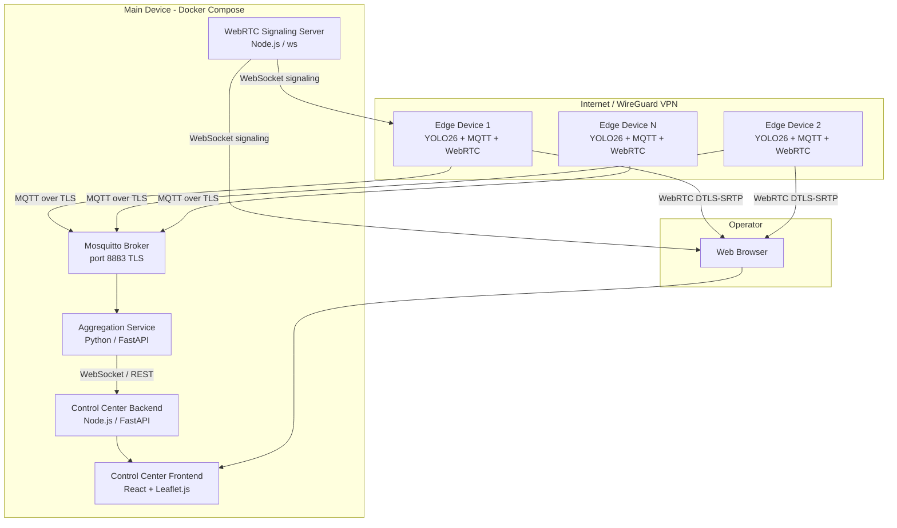
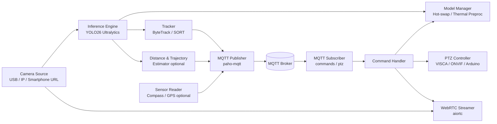
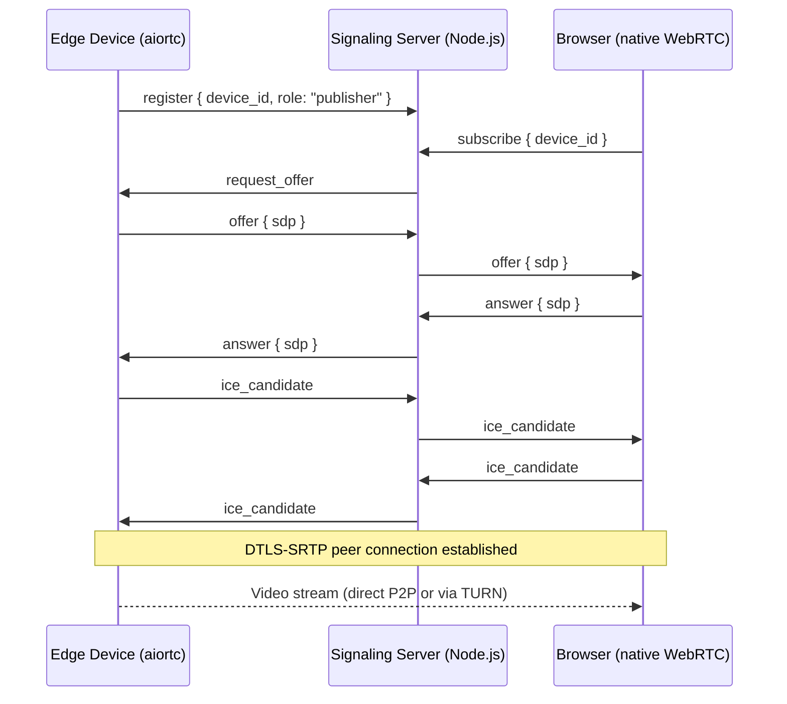
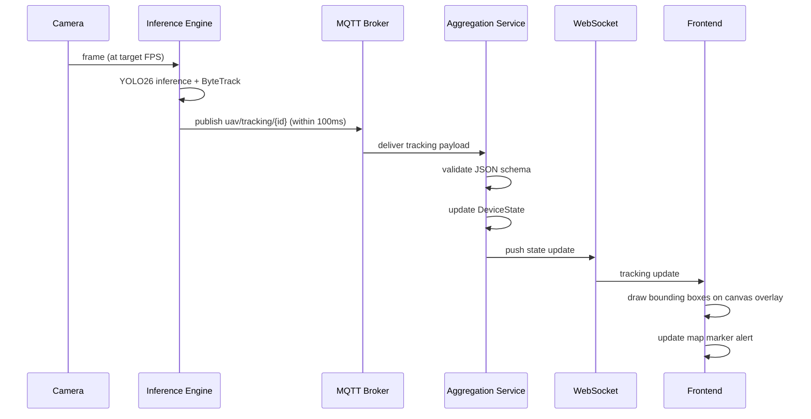
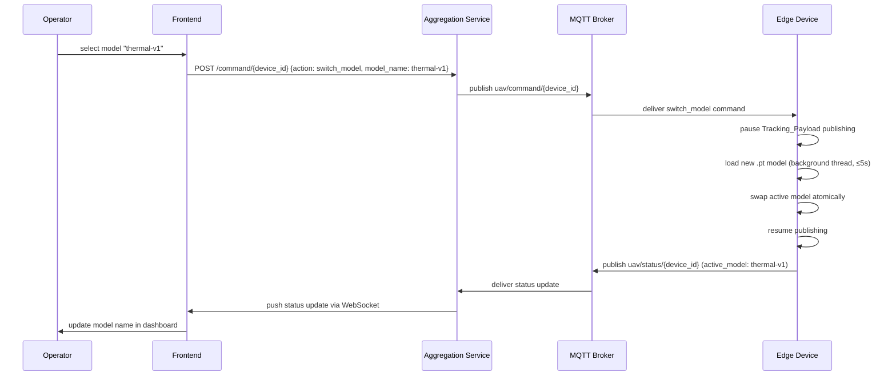

# Design Document: Anti-UAV Detection System

## Overview

The anti-UAV detection system is a distributed, real-time surveillance platform that runs YOLO v26 inference on edge devices to detect and track unmanned aerial vehicles. Edge devices publish structured tracking data over MQTT (TLS-encrypted) to a central main device, which aggregates detections and serves a web-based control center. Live video is streamed from edge devices to the control center via WebRTC. The system supports 5 or more simultaneous internet-connected edge devices and is fully orchestrated via Docker Compose on the main device.

### Research Foundations

The design incorporates findings from the following research:

- **YOLO26** (Sapkota et al., arXiv 2509.25164): YOLO26 introduces key architectural enhancements over prior YOLO generations including improved backbone efficiency and detection head design, achieving state-of-the-art real-time object detection performance. The Ultralytics implementation provides a unified `.pt` model format and Python API used directly in this system.

- **Edge DNN Deployment** (Stacker et al., ICCVW 2021 — "Deployment of Deep Neural Networks for Object Detection on Edge AI Devices With Runtime Optimization"): Demonstrates that runtime optimization techniques (quantization, TensorRT export, batch size tuning) are critical for achieving acceptable inference throughput on resource-constrained edge hardware. This informs our model export strategy and configurable frame rate design.

- **Thermal UAV Detection** ("Good Data Beats More Data: Building a Thermal Air-..."): Establishes that thermal imaging datasets with proper colormap normalization significantly outperform larger but poorly-curated visible-light datasets for UAV detection. This directly informs the thermal preprocessing pipeline in the model manager.

- **Sensor-Based UAV Detection** (sensors-21-02824): Multi-modal sensor fusion (camera + compass + GPS) improves detection reliability and enables bearing/trajectory estimation, informing the `sensor_data` field in the Tracking_Payload and the optional distance/trajectory estimation module.

- **UAV Detection Research** (2305.09972, 8524): Establish that small object detection in aerial imagery benefits from multi-scale feature extraction (addressed by YOLO26's FPN-based head) and that tracking continuity across frames is essential for trajectory estimation.

- **KFUPM Thesis**: Comprehensive treatment of anti-UAV system architectures, confirming the value of distributed edge inference with centralized aggregation and the importance of low-latency communication protocols.


## Architecture

### System Architecture Overview



### Network Topology

- Edge devices connect to the main device's MQTT broker over the internet (or local network) via TLS on port 8883.
- Remote operator access is via WireGuard VPN (primary) or HTTPS with token auth (optional non-VPN mode).
- WebRTC peer connections are established between edge devices and the operator's browser, with the signaling server on the main device brokering the SDP/ICE exchange.
- All Docker services bind to the host's local network interface except the MQTT broker port (8883) and optionally the HTTPS port, which are exposed publicly.


## Components and Interfaces

### Edge Device Software Stack

Each edge device runs a Python application with the following internal components:



#### Inference Engine
- Loads YOLO26 `.pt` model via `ultralytics.YOLO`
- Processes frames at configurable target FPS using a frame queue
- Applies thermal colormap normalization (CLAHE + colormap) when `camera_mode == "thermal"` — informed by the thermal UAV detection paper's finding that proper preprocessing is as important as model architecture
- Passes frames to the active model; collects `Results` objects
- Feeds detections into the tracker (ByteTrack, built into Ultralytics) for persistent track IDs

#### Model Manager
- Maintains a registry of named model profiles loaded from config
- Handles hot-swap: loads new model in a background thread, swaps atomically, resumes publishing
- Publishes current model name in the retained `uav/status/{device_id}` message

#### PTZ Controller
- Dispatches PTZ commands to the appropriate hardware driver based on config:
  - `visca_serial`: VISCA protocol over RS-232/USB serial
  - `visca_ip`: VISCA over UDP/TCP
  - `onvif`: ONVIF PTZ service via `onvif-zeep` Python library
  - `arduino`: Serial command protocol to Arduino firmware
  - `digital`: Software zoom/crop applied to the video frame
- Publishes PTZ status after each command to `uav/ptz/status/{device_id}`

#### WebRTC Streamer
- Uses `aiortc` (Python WebRTC library) to create a peer connection
- Receives SDP offer from the signaling server, sends answer
- Streams camera frames as a `VideoStreamTrack`; DTLS-SRTP is handled by aiortc automatically
- Starts/stops stream on `start_stream`/`stop_stream` commands

#### Distance & Trajectory Estimator (optional)
- Distance estimation: `d = (f * W_real) / W_bbox_pixels` where `f` is estimated focal length derived from frame width and a configurable FOV, `W_real` is the reference UAV size, and `W_bbox_pixels` is the bounding box width
- Trajectory: maintains a rolling window of N bounding box centroids per track ID; computes velocity vector as the mean displacement per frame; converts to real-world units when distance is known
- Informed by sensor-based UAV detection research showing that bounding-box-based ranging is viable for small UAVs at moderate distances

### Main Device Docker Services

#### Mosquitto MQTT Broker
- Eclipse Mosquitto 2.x in Docker
- TLS on port 8883 with configurable CA cert, server cert, and key
- Supports both certificate-based and username/password authentication
- `mosquitto.conf` generated from template with environment variable substitution
- Persistent message store for retained status messages

#### Aggregation Service
- Python / FastAPI application
- Subscribes to `uav/tracking/#`, `uav/status/#`, `uav/ptz/status/#`, `uav/sensor/#`, and optionally `uav/radar/#`
- Validates each Tracking_Payload against a JSON Schema (using `jsonschema` library)
- Maintains in-memory state: `Dict[device_id, DeviceState]` where `DeviceState` holds latest tracking payload, online status, PTZ status, and sensor data
- Exposes a WebSocket endpoint `/ws` that pushes state updates to the Control Center frontend
- Exposes REST endpoints for the Control Center backend to query device state
- Publishes commands to `uav/command/{device_id}` and `uav/ptz/{device_id}` on behalf of the frontend

#### Control Center Backend
- Serves the React frontend as static files
- Provides REST API for configuration queries (device list, model profiles)
- Proxies WebSocket connection from browser to Aggregation Service
- Handles HTTPS termination and token authentication in non-VPN mode (via nginx reverse proxy in the Docker Compose stack)

#### WebRTC Signaling Server
- Node.js with `ws` WebSocket library
- Implements a simple room-based signaling protocol: edge devices register as "publishers", browsers connect as "subscribers"
- Relays SDP offers/answers and ICE candidates between edge device and browser
- No media passes through the signaling server — it is pure signaling


### Control Center Frontend Architecture

- React (TypeScript) single-page application
- **Map View**: Leaflet.js with OpenStreetMap tiles (self-hosted via `openstreetmap-tile-server` Docker container or pre-cached tiles using `leaflet-offline`). Device markers rendered as custom icons; pulsing CSS animation on detection alert.
- **Live Feed Grid**: Up to 4 simultaneous WebRTC video elements in a CSS grid. Each `<video>` element is connected to a peer connection managed by the browser's native WebRTC API.
- **Tracking Overlay**: Canvas element overlaid on each video feed; bounding boxes and track IDs drawn from the latest Tracking_Payload received via WebSocket.
- **PTZ Controls**: Joystick component (using `react-joystick-component`) and discrete directional buttons; publishes PTZ commands via REST to the Aggregation Service.
- **Model Switcher**: Per-device dropdown listing available model profiles; issues `switch_model` command via REST.
- **Device Dashboard**: Table listing all devices with online/offline status badge, active model name, and detection count.

---

## Data Models

### Tracking Payload (JSON Schema)

```json
{
  "$schema": "http://json-schema.org/draft-07/schema#",
  "type": "object",
  "required": ["device_id", "timestamp", "frame_id", "detections"],
  "properties": {
    "device_id": { "type": "string" },
    "timestamp": { "type": "string", "format": "date-time" },
    "frame_id": { "type": "integer", "minimum": 0 },
    "active_model": { "type": "string" },
    "detections": {
      "type": "array",
      "items": {
        "type": "object",
        "required": ["track_id", "bbox", "confidence", "label"],
        "properties": {
          "track_id": { "type": "integer" },
          "bbox": {
            "type": "array",
            "items": { "type": "number" },
            "minItems": 4,
            "maxItems": 4,
            "description": "[x, y, w, h] in pixels"
          },
          "confidence": { "type": "number", "minimum": 0.0, "maximum": 1.0 },
          "label": { "type": "string" },
          "estimated_distance_m": { "type": "number", "minimum": 0 },
          "trajectory_vector": {
            "type": "object",
            "properties": {
              "dx_px_per_frame": { "type": "number" },
              "dy_px_per_frame": { "type": "number" }
            }
          }
        }
      }
    },
    "sensor_data": {
      "type": "object",
      "properties": {
        "compass_bearing_deg": { "type": "number", "minimum": 0, "maximum": 360 },
        "pitch_deg": { "type": "number", "minimum": -90, "maximum": 90 }
      }
    },
    "source": { "type": "string", "enum": ["camera", "radar"] }
  }
}
```

### Status Payload

Published as a retained message to `uav/status/{device_id}`:

```json
{
  "device_id": "edge-01",
  "status": "online",
  "active_model": "daylight-v1",
  "lat": 24.7136,
  "lon": 46.6753,
  "timestamp": "2025-01-01T00:00:00Z"
}
```

### PTZ Command Payload

Published to `uav/ptz/{device_id}`:

```json
{
  "command": "zoom_set",
  "zoom_level": 5,
  "pan_angle": null,
  "tilt_angle": null
}
```

### PTZ Status Payload

Published to `uav/ptz/status/{device_id}`:

```json
{
  "device_id": "edge-01",
  "zoom_level": 5,
  "pan_angle": 45.0,
  "tilt_angle": -10.0,
  "timestamp": "2025-01-01T00:00:00Z"
}
```

### Command Payload

Published to `uav/command/{device_id}`:

```json
{
  "action": "switch_model",
  "model_name": "thermal-v1"
}
```

### Sensor Payload

Published to `uav/sensor/{device_id}`:

```json
{
  "device_id": "edge-01",
  "compass_bearing_deg": 270.5,
  "pitch_deg": -5.2,
  "timestamp": "2025-01-01T00:00:00Z"
}
```

### Model Profile (device config)

```yaml
model_profiles:
  - name: daylight-v1
    file_path: /models/yolo26_daylight.pt
    camera_mode: daylight
  - name: night-v1
    file_path: /models/yolo26_night.pt
    camera_mode: night
  - name: thermal-v1
    file_path: /models/yolo26_thermal.pt
    camera_mode: thermal
```

### Device Configuration File (edge device)

```yaml
device_id: edge-01
mqtt:
  host: main-device.example.com
  port: 8883
  tls:
    ca_cert: /certs/ca.crt
    client_cert: /certs/edge-01.crt
    client_key: /certs/edge-01.key
camera:
  source: /dev/video0   # or rtsp://... or http://...
  fps: 15
location:
  lat: 24.7136
  lon: 46.6753
model_profiles:
  - name: daylight-v1
    file_path: /models/yolo26_daylight.pt
    camera_mode: daylight
active_model: daylight-v1
ptz:
  enabled: true
  hardware_type: visca_serial
  serial_port: /dev/ttyUSB0
  baud_rate: 9600
distance_estimation:
  enabled: false
  reference_uav_size_m: 0.5
trajectory_estimation:
  enabled: false
  window_frames: 10
arduino:
  enabled: false
  serial_port: /dev/ttyACM0
  baud_rate: 115200
```

### Docker Compose `.env` File (main device)

```env
MQTT_PORT=8883
MQTT_TLS_CA=/secrets/ca.crt
MQTT_TLS_CERT=/secrets/server.crt
MQTT_TLS_KEY=/secrets/server.key
AGGREGATION_PORT=8001
CONTROL_CENTER_PORT=8080
SIGNALING_PORT=8090
REMOTE_ACCESS_MODE=vpn   # vpn | https | local
HTTPS_TOKEN=changeme
RADAR_ENABLED=false
TILE_SERVER_URL=http://localhost:8070
```


## MQTT Topic Schema

| Topic | Publisher | Subscriber | Retained | Description |
|---|---|---|---|---|
| `uav/tracking/{device_id}` | Edge Device | Aggregation Service | No | Tracking payload per frame |
| `uav/status/{device_id}` | Edge Device | Aggregation Service, Control Center | Yes | Online/offline + model status |
| `uav/command/{device_id}` | Control Center | Edge Device | No | start_stream, stop_stream, switch_model |
| `uav/ptz/{device_id}` | Control Center | Edge Device | No | PTZ commands |
| `uav/ptz/status/{device_id}` | Edge Device | Aggregation Service | No | Current PTZ state |
| `uav/sensor/{device_id}` | Edge Device | Aggregation Service | No | Compass/GPS sensor data |
| `uav/radar/{radar_id}` | Radar Source | Aggregation Service | No | Radar track data (optional) |

### QoS Levels

- `uav/tracking/#`: QoS 0 (best-effort, high frequency, loss acceptable)
- `uav/status/#`: QoS 1 (at-least-once, retained)
- `uav/command/#`: QoS 1 (at-least-once, commands must arrive)
- `uav/ptz/#`: QoS 0 (best-effort, PTZ commands are superseded by newer ones)
- `uav/sensor/#`: QoS 0 (best-effort, high frequency)

---

## WebRTC Signaling and Streaming Architecture

### Signaling Flow



### TURN/STUN Configuration

- STUN: Google public STUN (`stun:stun.l.google.com:19302`) for NAT traversal in testing
- TURN: Configurable TURN server (e.g., coturn) for production deployments where P2P is blocked
- In WireGuard VPN mode, all devices share a private network so STUN/TURN is typically unnecessary

### Stream Lifecycle

1. Browser requests a feed → Control Center sends `start_stream` command via MQTT
2. Edge device starts WebRTC peer connection, registers with signaling server
3. Signaling exchange completes; video flows directly browser ↔ edge device
4. Browser requests stop → `stop_stream` command → edge device closes peer connection

---

## Data Flow Diagrams

### Detection Data Flow



### Model Switch Flow



---

## Security Architecture

### TLS for MQTT

- Mosquitto configured with `require_certificate true` or `password_file` depending on client type
- CA certificate signs both server cert and all client certs
- Edge devices present client certificates; the broker validates against the CA
- Username/password auth available as fallback (configured per-listener in `mosquitto.conf`)
- All certs stored in a `secrets/` directory outside version control; path injected via Docker volume mount

### WebRTC Security

- DTLS-SRTP is mandatory per the WebRTC standard; `aiortc` enforces this by default
- No plaintext RTP is ever transmitted
- Signaling server WebSocket can be secured with WSS (TLS) in production

### WireGuard VPN (Primary Remote Access)

- WireGuard runs on the main device as a Docker container (or host service)
- Each authorized remote operator has a WireGuard peer config with a unique private key
- All traffic between remote operators and the main device is encrypted at the network layer
- Control Center is only bound to the WireGuard interface in VPN-only mode

### HTTPS + Token Auth (Optional Non-VPN Mode)

- nginx reverse proxy in Docker Compose terminates TLS
- All requests require `Authorization: Bearer <token>` header
- Token configured via `HTTPS_TOKEN` environment variable
- System logs a startup warning when this mode is active (Requirement 15.5)
- Self-signed or Let's Encrypt certificate configurable

### Secrets Management

- TLS certificates, private keys, and MQTT credentials stored in `secrets/` directory
- Docker Compose mounts `secrets/` as read-only volumes into relevant containers
- `.gitignore` excludes `secrets/` and `.env`

---

## Optional Components Design

### Radar System Integration

- Enabled via `RADAR_ENABLED=true` in `.env`
- Aggregation Service subscribes to `uav/radar/{radar_id}` or polls a configurable REST endpoint
- Radar track normalization: maps radar track fields to Tracking_Payload schema with `source: "radar"` and `label: "radar"`
- Frontend renders radar tracks with a distinct marker style (e.g., diamond shape vs. circle for camera detections)
- If radar source is unreachable, Aggregation Service logs a warning every 60 seconds and continues operating

### Arduino-Based Camera Controller

- Enabled via `arduino.enabled: true` in device config
- Edge device opens a serial connection to the Arduino at startup
- PTZ commands received on `uav/ptz/{device_id}` are translated to a simple serial protocol:
  ```
  PAN:<angle>\n
  TILT:<angle>\n
  ZOOM:<level>\n
  HOME\n
  ```
- Arduino firmware reads these commands and drives servo motors accordingly
- The camera attached to the Arduino rig is treated as a standard USB or IP camera source by the Inference Engine

### Distance and Trajectory Estimation

- Distance formula (pinhole camera model):
  ```
  distance_m = (reference_size_m * focal_length_px) / bbox_width_px
  focal_length_px = frame_width_px / (2 * tan(horizontal_fov_rad / 2))
  ```
- Trajectory: rolling window of `window_frames` centroids per track ID; velocity vector = mean of frame-to-frame centroid displacements
- When compass bearing is available, the bearing to the UAV is computed as: `bearing = (camera_compass_bearing + atan2(dx_from_center, focal_length)) % 360`
- All optional fields (`estimated_distance_m`, `trajectory_vector`, `sensor_data`) are omitted from the payload when the feature is disabled

### Smartphone as IP Camera

- Configured via `camera.source: http://<phone_ip>:8080/video` (IP Webcam app URL)
- Sensor data (compass, GPS) published by a companion app or the same IP Webcam app to `uav/sensor/{device_id}` as a Sensor_Payload
- The Inference Engine treats the MJPEG or RTSP stream identically to any other IP camera source

---

## Technology Stack

| Component | Technology | Justification |
|---|---|---|
| Inference Engine | Python 3.11, `ultralytics` YOLO26 | Official Ultralytics API provides unified `.pt` loading, ByteTrack integration, and thermal preprocessing hooks |
| MQTT Client (edge) | `paho-mqtt` Python | Mature, well-tested, supports TLS and LWT natively |
| WebRTC (edge) | `aiortc` Python | Pure-Python WebRTC implementation; handles DTLS-SRTP automatically; integrates with asyncio |
| MQTT Broker | Eclipse Mosquitto 2.x | Industry standard; lightweight Docker image; full TLS + auth support |
| Aggregation Service | Python / FastAPI + `asyncio-mqtt` | Async MQTT subscription + WebSocket push in a single event loop; FastAPI for REST endpoints |
| JSON Schema validation | `jsonschema` Python | Standard library for Draft-07 schema validation |
| Control Center Backend | FastAPI (Python) or Node.js | Serves static frontend; proxies WebSocket; handles auth |
| WebRTC Signaling | Node.js + `ws` | Lightweight; well-suited for stateless signaling relay |
| Frontend | React (TypeScript) + Vite | Component model suits the multi-panel dashboard; TypeScript catches payload shape errors at compile time |
| Map | Leaflet.js + OpenStreetMap | Open-source; self-hostable tiles; no external dependency in production |
| PTZ (ONVIF) | `onvif-zeep` Python | ONVIF WSDL-based Python client |
| PTZ (VISCA) | Custom serial/UDP implementation | VISCA is a simple binary protocol; no suitable Python library exists |
| Docker Orchestration | Docker Compose v2 | Single-file orchestration; `depends_on` for startup ordering; `unless-stopped` restart policy |
| VPN | WireGuard | Minimal attack surface; kernel-level performance; simple key-based auth |
| Tile Server | `overv/openstreetmap-tile-server` Docker | Self-hosted OSM tiles; no internet dependency in production |
| Property-Based Testing | `hypothesis` (Python) | Mature PBT library for Python; integrates with pytest; supports custom strategies |

---

## Correctness Properties

*A property is a characteristic or behavior that should hold true across all valid executions of a system — essentially, a formal statement about what the system should do. Properties serve as the bridge between human-readable specifications and machine-verifiable correctness guarantees.*

### Property 1: Tracking Payload Round-Trip Serialization

*For any* valid Tracking_Payload object produced by the Inference Engine, serializing it to JSON and then deserializing it must produce an object that is structurally and semantically equivalent to the original.

**Validates: Requirements 9.3**

---

### Property 2: Tracking Payload Schema Validation Rejects Invalid Payloads

*For any* JSON object that violates the Tracking_Payload schema — including missing required fields, wrong field types, `confidence` values outside [0.0, 1.0], negative `frame_id`, or malformed `timestamp` — the Aggregation Service's schema validator must reject it and must not update the device state.

**Validates: Requirements 9.1, 9.2, 9.4**

---

### Property 3: Device Registry Reflects Status Messages

*For any* sequence of `online` and `offline` status messages published for a given `device_id`, the Aggregation Service's device registry must reflect the status of the most recently received message for that device.

**Validates: Requirements 4.3**

---

### Property 4: PTZ Command Published to Correct Topic with Valid Structure

*For any* PTZ command issued by the operator for a given `device_id`, the published MQTT message must be delivered to the topic `uav/ptz/{device_id}` and must contain a `command` field whose value is one of the defined PTZ command types (`zoom_in`, `zoom_out`, `zoom_set`, `rotate_left`, `rotate_right`, `rotate_set`, `tilt_up`, `tilt_down`, `tilt_set`, `reset_home`).

**Validates: Requirements 13.2, 13.3**

---

### Property 5: Control Command Published to Correct Topic

*For any* start or stop stream command issued by the operator for a given `device_id`, the published MQTT message must be delivered to the topic `uav/command/{device_id}` and must contain an `action` field set to `"start_stream"` or `"stop_stream"` respectively.

**Validates: Requirements 7.1, 7.2**

---

### Property 6: Radar Track Normalization Preserves Required Fields

*For any* radar track data received from a Radar_Source, the normalized Tracking_Payload produced by the Aggregation Service must have `source` set to `"radar"`, `label` set to `"radar"`, and must conform to the Tracking_Payload JSON schema.

**Validates: Requirements 14.2**

---

### Property 7: Distance Estimation is Positive and Monotonically Decreasing with Bbox Size

*For any* frame with a detected UAV bounding box, given a fixed reference UAV size and fixed focal length, the estimated distance must be strictly positive, and for any two bounding box widths where `w1 > w2`, the estimated distance for `w1` must be strictly less than the estimated distance for `w2` (larger apparent size → closer distance).

**Validates: Requirements 17.1**

---

### Property 8: Trajectory Vector Reflects Direction of Motion

*For any* sequence of bounding box centroids for a tracked UAV across N frames, the computed trajectory vector `(dx, dy)` must equal the mean of the frame-to-frame centroid displacements across the window.

**Validates: Requirements 17.2**

---

### Property 9: Sensor Payload Fields are Within Valid Ranges

*For any* Sensor_Payload published by an edge device, `compass_bearing_deg` must be in [0, 360) and `pitch_deg` must be in [-90, 90].

**Validates: Requirements 17.3**

---

### Property 10: Model Profile Structure is Valid

*For any* model profile defined in the device configuration, it must contain a non-empty `name` string, a non-empty `file_path` string, and a `camera_mode` value that is one of `"daylight"`, `"night"`, or `"thermal"`.

**Validates: Requirements 18.1**

---

### Property 11: Status Message Includes Active Model Name

*For any* retained `uav/status/{device_id}` message published by an edge device, the message must include an `active_model` field whose value matches the name of the currently loaded model profile.

**Validates: Requirements 18.7**

---

### Property 12: Thermal Preprocessing Changes Frame Data

*For any* camera frame processed when the active model profile has `camera_mode == "thermal"`, the preprocessed frame passed to the model must differ from the raw input frame (i.e., the colormap normalization transform must have been applied and must not be a no-op).

**Validates: Requirements 18.10**

---

### Property 13: Alert Marker Displays Required Detection Fields

*For any* detection event rendered on the map, the alert marker data structure must contain the `device_id`, a valid UTC `timestamp`, and a non-negative integer `detection_count`.

**Validates: Requirements 12.4**

---

## Error Handling

### Edge Device

| Condition | Behavior |
|---|---|
| PT_Model file not found at startup | Log error with path, exit with code 1 |
| Camera feed unavailable | Log disconnection, retry every 5 seconds, resume inference on reconnect |
| MQTT broker connection lost | Exponential backoff reconnect (1s, 2s, 4s, … max 60s) |
| `switch_model` command with missing file | Log error, retain current model, publish error status to `uav/status/{device_id}` |
| PTZ command on non-PTZ device | Silently ignore (no log) |
| Required config parameter missing | Log parameter name, exit with code 1 |
| Serial port unavailable (Arduino/VISCA) | Log error, disable PTZ for this session, continue inference |

### Aggregation Service

| Condition | Behavior |
|---|---|
| Tracking_Payload fails JSON schema validation | Log malformed message with `device_id`, discard, do not crash |
| `confidence` outside [0.0, 1.0] | Reject payload, log validation error with `device_id` |
| Radar source unreachable (when enabled) | Log warning every 60s, continue with camera-only data |
| MQTT broker connection lost | Reconnect with backoff, log each attempt |
| WebSocket client disconnects | Remove from subscriber list, no error |

### Control Center

| Condition | Behavior |
|---|---|
| Command acknowledgement timeout (5s) | Display timeout warning to operator |
| Live feed stream interrupted | Display visual indicator, attempt WebRTC reconnect automatically |
| Device disconnects | Update status to offline within 2s, grey out map marker |
| Detection alert auto-clear timeout | Remove alert state from marker after configurable timeout |

---

## Testing Strategy

### Dual Testing Approach

Both unit tests and property-based tests are required. They are complementary:
- Unit tests verify specific examples, integration points, and error conditions
- Property-based tests verify universal correctness across all valid inputs

### Property-Based Testing

**Library**: `hypothesis` (Python) with `pytest`

Each property-based test must run a minimum of 100 iterations (configured via `@settings(max_examples=100)`).

Each test must be tagged with a comment referencing the design property:
```python
# Feature: anti-uav-detection-system, Property 1: Tracking Payload Round-Trip Serialization
```

**Property test implementations:**

| Property | Test Description | Hypothesis Strategy |
|---|---|---|
| P1: Round-trip serialization | Generate random valid Tracking_Payload dicts; serialize to JSON string; deserialize; assert equality | `st.fixed_dictionaries` with nested strategies for detections |
| P2: Schema validation rejects invalid | Generate payloads with one field mutated to be invalid (wrong type, out-of-range confidence, missing required field); assert validator rejects | `st.one_of` for mutation strategies |
| P3: Device registry reflects status | Generate random sequences of online/offline status messages for random device IDs; assert registry state matches last message per device | `st.lists(st.sampled_from(["online","offline"]))` |
| P4: PTZ command topic and structure | Generate random device IDs and PTZ command types; assert published topic matches pattern and command is in valid set | `st.text()` for device_id, `st.sampled_from` for command |
| P5: Control command topic | Generate random device IDs and actions; assert topic and action field are correct | `st.text()` for device_id |
| P6: Radar normalization | Generate random radar track dicts; normalize; assert `source=="radar"`, `label=="radar"`, schema valid | `st.fixed_dictionaries` |
| P7: Distance estimation monotonicity | Generate pairs of bbox widths `(w1, w2)` where `w1 > w2 > 0`; assert `distance(w1) < distance(w2)` | `st.floats(min_value=1.0)` |
| P8: Trajectory vector correctness | Generate random sequences of N centroids; assert computed vector equals mean displacement | `st.lists(st.tuples(st.floats(), st.floats()), min_size=2)` |
| P9: Sensor payload range | Generate random sensor payloads; assert bearing in [0,360) and pitch in [-90,90] | `st.floats` with bounds |
| P10: Model profile structure | Generate random model profile dicts; validate structure; assert all required fields present and camera_mode valid | `st.fixed_dictionaries` |
| P11: Status includes active model | Generate random model profile names; simulate status publish; assert active_model field matches | `st.text(min_size=1)` |
| P12: Thermal preprocessing changes frame | Generate random numpy arrays as frames; apply thermal preprocessing; assert output != input | `st.from_type(np.ndarray)` via `hypothesis[numpy]` |
| P13: Alert marker fields | Generate random detection events; build alert marker; assert device_id, timestamp, detection_count present | `st.fixed_dictionaries` |

### Unit Tests

Unit tests focus on:
- Specific examples: loading a known-good `.pt` model path, parsing a known-good config file
- Integration points: MQTT client connects and publishes a message to a local broker (using `mosquitto` in a test container)
- Error conditions: missing model file exits with code 1, missing config parameter exits with code 1, invalid JSON payload is discarded without crash
- Edge cases: empty detections array in payload, zero-length trajectory window, `confidence == 0.0` and `confidence == 1.0` boundary values

### Test Configuration

```python
# conftest.py / pytest.ini
[pytest]
addopts = --hypothesis-seed=0
```

```python
from hypothesis import settings, HealthCheck
settings.register_profile("ci", max_examples=100, suppress_health_check=[HealthCheck.too_slow])
settings.load_profile("ci")
```

