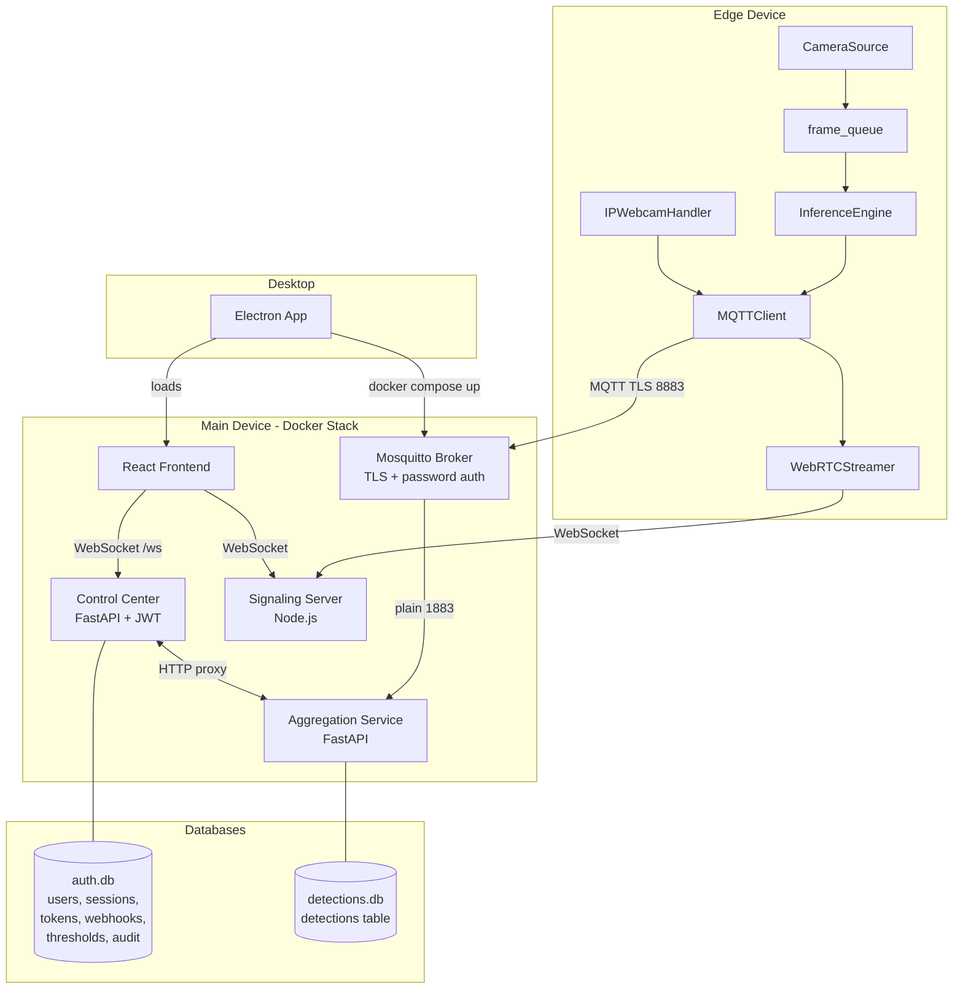

# Design Document: Anti-UAV Control Center v3

## Overview

V3 is an incremental enhancement to the existing distributed anti-UAV detection system. The system already has a working foundation: edge devices run YOLO inference and publish over MQTT (TLS, cert-based) to a Mosquitto broker; a FastAPI aggregation service maintains device state and pushes WebSocket updates; a FastAPI control-center serves the React frontend and handles JWT auth; a Node.js signaling server handles WebRTC negotiation.

V3 adds twelve features across all layers:

1. MQTT username/password auth (replacing per-device client certs)
2. Token management UI (Settings page)
3. Session management UI (Settings page)
4. Edge device config push (Device Detail page)
5. Detection history export (CSV download)
6. Per-device alert thresholds
7. Multi-device PTZ follow
8. Notification webhooks
9. Edge offline detection (health timeout)
10. Improved launchers (tabbed, live logs)
11. Electron desktop app
12. Bounding box color scheme update + WebRTC black screen fix + IP Webcam remote control

The design decisions below resolve the ten open questions from the spec.

---

## Architecture

The overall architecture is unchanged. V3 adds new tables to `auth.db`, a new `detections.db` in the aggregation container, new MQTT topics, new REST endpoints, and new frontend pages/panels.



### Key Design Decisions

**1. MQTT password auth:** Mosquitto already supports `MQTT_AUTH_MODE=password` via its entrypoint. The password file uses the standard Mosquitto `passwd` format (generated with `mosquitto_passwd`). The edge `config.yaml` gains `mqtt.username` and `mqtt.password` fields. The `MQTTClient` already has the fallback path (`username_pw_set`) — it just needs to be the primary path. The `gen_certs.sh` script is updated to skip per-device client cert generation. The launcher replaces the three cert fields with a single password field.

**2. Sessions table:** JWT blocklist stays in-memory (`_jti_blocklist` set in `auth.py`) — acceptable because JWT TTL is 8 hours and restarts are rare. The `sessions` table in `auth.db` is the source of truth for the admin UI. `last_seen` is updated on every authenticated request (throttled to once per 60 seconds per jti to avoid write storms on busy connections).

**3. Detection persistence:** A separate `detections.db` file inside the aggregation container volume (`aggregation-data:/app/data/detections.db`). This keeps it isolated from `auth.db` and avoids cross-container DB access. The aggregation service opens it with `aiosqlite` on startup and auto-creates the table.

**4. PTZ follow bearing calculation:** Given leader GPS `(lat1, lon1)` and bounding box center normalized `(cx, cy)` in `[0,1]`, the bearing is computed as:
```
# Approximate: treat bounding box center as angular offset from camera center
# using camera FOV (default 60°)
fov_deg = config.get("camera.fov_deg", 60.0)
pan_offset_deg = (cx - 0.5) * fov_deg
bearing_deg = (leader_compass_bearing + pan_offset_deg) % 360
```
If the leader has no compass sensor, bearing falls back to `pan_offset_deg` alone (relative pan). The aggregation service reads `leader_compass_bearing` from the leader's last sensor payload.

**5. Webhook delivery:** Async background task using `asyncio.create_task` with `httpx.AsyncClient` and a 5-second timeout. Fire-and-forget — failures are logged, no retry. This avoids blocking the MQTT message processing loop.

**6. Health timeout checker:** `asyncio` background task in the aggregation service, started in `lifespan`. Runs every 10 seconds, iterates all devices, checks `last_health_ts`. Devices that were `online` and have not sent a health message in >60 seconds transition to `health_timeout`.

**7. Electron app:** Lives at `electron/` at the repo root. Main process (`main.js`) spawns `docker compose up -d`, polls `http://localhost:8080/auth/me` (unauthenticated → 401 = stack ready), then shows the `BrowserWindow`. System tray uses `electron.Tray`. Packaged with `electron-builder` as AppImage + PKGBUILD.

**8. Launcher redesign:** Both launchers use `ttk.Notebook` with three tabs: Config, Status, Logs. Log tailing uses a `threading.Thread` reading from the subprocess stdout pipe. Service status polling uses `subprocess.run(["docker", "compose", "ps", ...])` every 5 seconds in a daemon thread, updating label colors via `widget.after(0, ...)`.

**9. IP Webcam proxy:** New `edge/ipwebcam_handler.py` module. Capabilities are fetched once on startup and cached in memory; re-fetched on `ipwebcam_control` command if cache is stale (>5 minutes). The handler uses `urllib.request` (already available, no extra deps) to forward commands to the IP Webcam HTTP API.

**10. WebRTC black screen fix:** `CameraVideoTrack._get_frame()` loops with `queue.get(timeout=0.05)` and checks a `_stop_event` instead of returning zeros on timeout. `WebRTCStreamer._create_offer()` waits for the first frame before calling `addTrack`. The `useWebRTCStream` hook calls `videoRef.current.play()` in `ontrack` and transitions to `"connected"` only on the `canplay` event. `FeedCell` adds `onCanPlay` to the `<video>` element.

---

## Components and Interfaces

### 1. Mosquitto (MQTT Broker)

**Changes:** `entrypoint.sh` already handles `MQTT_AUTH_MODE=password`. The `docker-compose.yml` gains a `MQTT_PASSWORD_FILE` env var pointing to `/secrets/mqtt_passwords`. The `gen_certs.sh` script drops the per-device cert loop.

**New env vars in `.env`:**
```
MQTT_AUTH_MODE=password
MQTT_PASSWORD_FILE=/secrets/mqtt_passwords
```

**Password file format** (Mosquitto `passwd` format, generated with `mosquitto_passwd -b`):
```
edge-01:$7$...hashed...
edge-02:$7$...hashed...
```

The launcher generates this file using `mosquitto_passwd` (available in the `mosquitto` package) or a Python fallback using `passlib`.

### 2. Edge Device

**`edge/config.yaml` schema additions:**
```yaml
mqtt:
  host: 10.42.0.1
  port: 8883
  username: edge-01        # NEW: device_id used as username
  password: "secret123"    # NEW: pre-shared password
  tls:
    ca_cert: ./secrets/ca.crt
    # client_cert and client_key are now OPTIONAL
ipwebcam:                  # NEW: optional
  url: http://192.168.1.x:8080
ptz:
  enabled: true
  hardware_type: digital
  follow_leader: edge-01   # NEW: optional
```

**`edge/mqtt_client.py`:** The existing fallback path (`username_pw_set`) becomes the primary path when `mqtt.tls.client_cert` is absent. No structural change needed.

**`edge/command_handler.py`:** Add `update_config` and `ipwebcam_control` action handlers.

**`edge/ipwebcam_handler.py`** (new file):
```python
class IPWebcamHandler:
    def __init__(self, config, mqtt_client): ...
    def fetch_capabilities(self) -> dict: ...
    def handle_control(self, setting: str, value=None) -> bool: ...
    def fetch_snapshot(self, af: bool = False) -> bytes: ...
    def fetch_sensors(self) -> dict: ...
```

**`edge/edge_sim.py`** (new file): Simulates a second edge device publishing health and tracking payloads over MQTT for PTZ follow testing.

### 3. Aggregation Service

**New files:**
- `main/aggregation/detections_db.py` — aiosqlite wrapper for `detections.db`
- `main/aggregation/health_checker.py` — background task for health timeout
- `main/aggregation/webhook_dispatcher.py` — async webhook delivery
- `main/aggregation/ptz_follow.py` — bearing computation and follower dispatch
- `main/aggregation/thresholds.py` — per-device threshold config (in-memory + persisted to aggregation config file)

**`DeviceState` additions:**
```python
status: str  # now includes "health_timeout"
last_health_ts: Optional[float]  # monotonic timestamp of last health message
follow_leader: Optional[str]     # from status payload
ipwebcam_capabilities: Optional[dict]
ipwebcam_sensors: Optional[dict]
```

**New REST endpoints on aggregation:**
```
GET  /devices/{device_id}/detections/export?from=&to=&format=csv
GET  /devices/{device_id}/thresholds
PUT  /devices/{device_id}/thresholds
```

**New MQTT topics subscribed:**
```
uav/ipwebcam/capabilities/{device_id}
uav/ipwebcam/sensors/{device_id}
uav/snapshot/{device_id}
```

### 4. Control Center

**`auth.py` schema additions** (auto-migrated in `init_db()`):
```sql
CREATE TABLE IF NOT EXISTS sessions (
    jti TEXT PRIMARY KEY,
    username TEXT NOT NULL,
    display_name TEXT NOT NULL,
    login_time TEXT NOT NULL,
    last_seen TEXT NOT NULL,
    user_agent TEXT,
    expires_at TEXT NOT NULL
);

CREATE TABLE IF NOT EXISTS webhooks (
    id INTEGER PRIMARY KEY AUTOINCREMENT,
    url TEXT NOT NULL,
    events TEXT NOT NULL,   -- comma-separated: detection_alert,device_online,device_offline
    secret TEXT NOT NULL DEFAULT '',
    enabled INTEGER NOT NULL DEFAULT 1
);
```

The `invite_tokens` table already exists; no schema change needed for Requirement 2.

**New API routes on control-center:**
```
GET    /api/tokens
DELETE /api/tokens/{token}
GET    /api/sessions
DELETE /api/sessions/{jti}
GET    /api/webhooks
POST   /api/webhooks
PUT    /api/webhooks/{id}
DELETE /api/webhooks/{id}
POST   /api/webhooks/{id}/test
GET    /api/devices/{device_id}/thresholds   (proxied)
PUT    /api/devices/{device_id}/thresholds   (proxied)
GET    /api/devices/{device_id}/detections/export  (proxied)
```

**`last_seen` throttle:** A module-level `dict[str, float]` maps `jti → last_update_monotonic`. The middleware only writes to DB if `time.monotonic() - last_update > 60`.

### 5. React Frontend

**Settings page tabs** (new tabs added to existing `ttk.Notebook`-style tab structure):
- Appearance (existing)
- Users (existing)
- Tokens (new — admin only)
- Sessions (new — admin only)
- Notifications (new — admin only, webhooks)

**Device Detail page additions:**
- Edit Config panel (camera_source, fps, active_model)
- IP Webcam Controls panel (visible when `ipwebcam_capabilities` present)
- Snapshot modal

**Logs page additions:**
- Export Detections button with date range picker and device selector

**Dashboard additions:**
- Amber/yellow indicator for `health_timeout` devices

**`getClassColor` signature change:**
```typescript
export function getClassColor(
  label: string,
  confidence?: number,
  profileColors?: Record<string, string>
): string
```

### 6. Launchers

**`launcher_main.py`:** Replace single-tab layout with `ttk.Notebook` (Config, Status, Logs tabs). Config tab retains all existing functionality. Status tab shows per-service health dots updated every 5s. Logs tab tails `docker compose logs -f` output.

**`launcher_edge.py`:** Replace single-tab layout with `ttk.Notebook` (Config, Status, Logs tabs). Config tab replaces cert fields with a single password field. Status tab shows inference process status and MQTT connection state. Logs tab tails subprocess stdout.

### 7. Electron App

**Directory structure:**
```
electron/
  main.js          # Main process: tray, BrowserWindow, docker compose lifecycle
  preload.js       # Context bridge (minimal — no Node APIs exposed to renderer)
  package.json
  electron-builder.yml
  PKGBUILD         # Arch Linux package
```

**Stack readiness check:** Poll `http://localhost:8080` every 2 seconds with a 1-second timeout. Show loading screen until HTTP 200 or 401 is received (both indicate the stack is up).

---

## Data Models

### `auth.db` tables (control-center container)

```sql
-- Existing (unchanged)
users (username PK, display_name, password_hash, role, created_at, last_login, active)
invite_tokens (token PK, role, created_by, created_at, expires_at, used_by, used_at)
audit_log (id PK, username, display_name, action, device_id, payload, timestamp)

-- New in v3
sessions (
    jti TEXT PRIMARY KEY,
    username TEXT NOT NULL,
    display_name TEXT NOT NULL,
    login_time TEXT NOT NULL,
    last_seen TEXT NOT NULL,
    user_agent TEXT,
    expires_at TEXT NOT NULL
);

webhooks (
    id INTEGER PRIMARY KEY AUTOINCREMENT,
    url TEXT NOT NULL,
    events TEXT NOT NULL,
    secret TEXT NOT NULL DEFAULT '',
    enabled INTEGER NOT NULL DEFAULT 1
);
```

### `detections.db` (aggregation container)

```sql
CREATE TABLE IF NOT EXISTS detections (
    id INTEGER PRIMARY KEY AUTOINCREMENT,
    device_id TEXT NOT NULL,
    timestamp TEXT NOT NULL,   -- ISO 8601
    label TEXT NOT NULL,
    confidence REAL NOT NULL,
    bbox_x REAL NOT NULL,
    bbox_y REAL NOT NULL,
    bbox_w REAL NOT NULL,
    bbox_h REAL NOT NULL,
    track_id INTEGER
);
CREATE INDEX IF NOT EXISTS idx_detections_device_ts
    ON detections (device_id, timestamp);
```

### Per-device threshold config (aggregation in-memory + JSON file)

```python
@dataclass
class DeviceThreshold:
    device_id: str
    min_confidence: float = 0.5
    consecutive_frames: int = 1
    alert_classes: list[str] = field(default_factory=lambda: ["drone"])
```

Persisted to `/app/data/thresholds.json` in the aggregation container volume so they survive restarts.

### Webhook payload schema

```json
{
  "event": "detection_alert",
  "device_id": "edge-01",
  "timestamp": "2025-01-01T00:00:00Z",
  "data": {
    "detections": [...],
    "confidence_max": 0.92
  }
}
```

### Edge `config.yaml` additions

```yaml
mqtt:
  username: edge-01
  password: "secret"
  tls:
    ca_cert: ./secrets/ca.crt
    # client_cert / client_key: removed (optional, backward-compatible)

ipwebcam:
  url: http://192.168.1.x:8080   # optional

ptz:
  enabled: true
  hardware_type: digital
  follow_leader: edge-01          # optional
```

---

## Correctness Properties

*A property is a characteristic or behavior that should hold true across all valid executions of a system — essentially, a formal statement about what the system should do. Properties serve as the bridge between human-readable specifications and machine-verifiable correctness guarantees.*

### Property 1: MQTT client uses config credentials

*For any* edge device config containing `mqtt.username` and `mqtt.password`, the `MQTTClient` constructor SHALL call `username_pw_set` with exactly those values before connecting.

**Validates: Requirements 1.3**

### Property 2: Token status is always correctly computed

*For any* invite token record with fields `used_by` and `expires_at`, the computed `status` field SHALL be `"used"` if `used_by` is non-null, `"expired"` if `expires_at` is in the past and `used_by` is null, and `"pending"` otherwise — with no overlap between states.

**Validates: Requirements 2.1, 2.2, 2.3, 2.4**

### Property 3: Session insert round-trip

*For any* successful login, a subsequent `GET /api/sessions` (admin) SHALL return a session row whose `jti` matches the JWT issued during login, `username` matches the logged-in user, and `login_time` is within 5 seconds of the login request time.

**Validates: Requirements 3.2, 3.5**

### Property 4: Session revocation removes from active list

*For any* active session, calling `DELETE /api/sessions/{jti}` SHALL result in that `jti` no longer appearing in `GET /api/sessions` and subsequent requests using that JWT SHALL be rejected with HTTP 401.

**Validates: Requirements 3.4, 3.6**

### Property 5: update_config applies exactly the provided fields

*For any* non-empty subset of `{camera_source, fps, active_model}` sent in an `update_config` command, the edge device SHALL update exactly those fields in its running components and leave all other fields unchanged.

**Validates: Requirements 4.1, 4.2, 4.5**

### Property 6: Detection persistence round-trip

*For any* tracking payload containing N detections, after processing the payload the detections database SHALL contain exactly N new rows for that `device_id` with `label`, `confidence`, and `bbox` fields matching the payload detections.

**Validates: Requirements 5.1, 5.2**

### Property 7: Export time range filter

*For any* set of persisted detections and any `from`/`to` time range, the exported CSV SHALL contain only rows whose `timestamp` falls within `[from, to]` inclusive, and SHALL contain all such rows.

**Validates: Requirements 5.3, 5.4, 5.5**

### Property 8: Alert threshold filtering

*For any* detection event with confidence `C` and label `L`, and device threshold config with `min_confidence T`, `alert_classes A`, and `consecutive_frames F=1`, a WebSocket alert SHALL be emitted if and only if `C >= T` and `L ∈ A`.

**Validates: Requirements 6.2, 6.3, 6.4**

### Property 9: PTZ bearing is always in [0, 360)

*For any* leader GPS coordinates, compass bearing, and bounding box center position, the computed PTZ follow bearing SHALL be a float in the range `[0, 360)`.

**Validates: Requirements 7.2, 7.4**

### Property 10: Webhook HMAC signature is verifiable

*For any* webhook payload body and non-empty secret, the `X-UAV-Signature` header value SHALL equal `hmac-sha256=` + the hex-encoded HMAC-SHA256 of the payload body bytes using the secret, and SHALL be independently verifiable by the receiver.

**Validates: Requirements 8.6**

### Property 11: Health timeout transitions correctly

*For any* device that was `online` and whose last health message timestamp is more than 60 seconds in the past, the health checker background task SHALL set that device's status to `health_timeout` on its next run.

**Validates: Requirements 9.1, 9.2, 9.7**

### Property 12: Bounding box color follows confidence rules

*For any* detection with label `"drone"` and confidence `C`, `getClassColor("drone", C)` SHALL return `"#ef4444"` if `C >= 0.5` and `"#f97316"` if `C < 0.5`. For label `"bird"` at any confidence, it SHALL return `"#22c55e"`.

**Validates: Requirements 12.1, 12.2, 12.3**

### Property 13: IP Webcam control URL construction

*For any* supported `setting` and valid `value`, the `IPWebcamHandler` SHALL construct the correct HTTP URL matching the specification (e.g., `zoom?level={value}`, `settings/torch?set={value}`) before forwarding the request.

**Validates: Requirements 14.7–14.26**

---

## Error Handling

### MQTT Authentication Failures
- Edge device: if `mqtt.username` is absent, log `WARNING` and attempt unauthenticated connection (backward compatibility). If broker rejects the connection (rc != 0), existing exponential backoff reconnect logic handles retries.
- Broker: Mosquitto returns CONNACK with rc=5 (not authorized) for bad credentials. The edge device logs the error and retries with backoff.

### Detection DB Failures
- If `detections.db` write fails, log the error and continue processing. Detection persistence is best-effort — it must not block the MQTT message loop.
- On startup, if the DB file is corrupt, delete and recreate it (log a warning).

### Webhook Delivery Failures
- Non-2xx response or network error: log `WARNING` with URL, status code, and event type. No retry. The webhook is not disabled automatically.
- Timeout (5s): treated as a network error.

### Health Timeout Edge Cases
- If a device sends a health message after being marked `health_timeout`, it transitions back to `online` immediately.
- Devices that are `offline` (LWT-based) are not checked by the health timeout task — only `online` and `health_timeout` devices are monitored.

### Config Push Failures
- If `update_config` contains an unrecognized field, it is silently ignored. Recognized fields are applied atomically where possible.
- If `camera_source` update fails (e.g., new source unreachable), the `CameraSource` retries with its existing reconnect logic; the old source is stopped first.

### Session `last_seen` Throttle
- The throttle dict is module-level and not persisted. On restart, all sessions will update `last_seen` on their first request after restart. This is acceptable.

### Electron App
- If `docker compose up` fails, show an error dialog with the compose output and a "Retry" button.
- If the stack takes more than 60 seconds to become ready, show a timeout error with a "Retry" button.

### WebRTC Black Screen
- `CameraVideoTrack._get_frame()` loops with 50ms sleep checking `_stop_event`. If the stop event is set, it raises `StopIteration` to terminate the track cleanly.
- The last-frame fallback is stored as `self._last_frame: Optional[np.ndarray] = None` and updated on every successful `queue.get()`.

---

## Testing Strategy

### Unit Tests (example-based)

- `test_mqtt_client.py`: verify `username_pw_set` is called with config values; verify warning logged when username absent.
- `test_command_handler.py`: verify `update_config` dispatches to correct components; verify unknown fields are ignored.
- `test_ipwebcam_handler.py`: verify URL construction for each supported setting.
- `test_token_status.py`: verify status computation for used/expired/pending tokens.
- `test_bearing.py`: verify bearing stays in [0, 360) for edge-case inputs (poles, 180° meridian).
- `test_classColors.ts`: verify color rules for drone/bird at various confidence levels.
- `test_webrtc_streamer.py`: verify `_get_frame()` returns last frame when queue is empty; verify track is not added before first frame.

### Property-Based Tests (Hypothesis for Python, fast-check for TypeScript)

Each property test runs a minimum of 100 iterations.

**Python (Hypothesis):**

```python
# Feature: uav-control-center-v3, Property 1: MQTT client uses config credentials
@given(username=st.text(min_size=1), password=st.text())
def test_mqtt_uses_config_credentials(username, password): ...

# Feature: uav-control-center-v3, Property 2: Token status computation
@given(used_by=st.one_of(st.none(), st.text(min_size=1)),
       expires_at=st.datetimes())
def test_token_status_computed_correctly(used_by, expires_at): ...

# Feature: uav-control-center-v3, Property 6: Detection persistence round-trip
@given(detections=st.lists(detection_strategy(), min_size=0, max_size=20))
def test_detection_persistence_roundtrip(detections): ...

# Feature: uav-control-center-v3, Property 7: Export time range filter
@given(detections=st.lists(...), from_ts=st.datetimes(), to_ts=st.datetimes())
def test_export_time_range_filter(detections, from_ts, to_ts): ...

# Feature: uav-control-center-v3, Property 8: Alert threshold filtering
@given(confidence=st.floats(0.0, 1.0), label=st.sampled_from(["drone","bird","person"]),
       min_confidence=st.floats(0.0, 1.0), alert_classes=st.lists(st.text()))
def test_alert_threshold_filtering(confidence, label, min_confidence, alert_classes): ...

# Feature: uav-control-center-v3, Property 9: PTZ bearing in [0, 360)
@given(lat=st.floats(-90, 90), lon=st.floats(-180, 180),
       compass=st.floats(0, 360), cx=st.floats(0, 1))
def test_ptz_bearing_range(lat, lon, compass, cx): ...

# Feature: uav-control-center-v3, Property 10: Webhook HMAC verifiable
@given(body=st.binary(), secret=st.text(min_size=1))
def test_webhook_hmac_verifiable(body, secret): ...

# Feature: uav-control-center-v3, Property 11: Health timeout transitions
@given(elapsed_s=st.floats(min_value=0, max_value=300))
def test_health_timeout_transition(elapsed_s): ...

# Feature: uav-control-center-v3, Property 13: IP Webcam URL construction
@given(setting=st.sampled_from(SUPPORTED_SETTINGS), value=st.one_of(st.none(), st.text()))
def test_ipwebcam_url_construction(setting, value): ...
```

**TypeScript (fast-check):**

```typescript
// Feature: uav-control-center-v3, Property 12: Bounding box color rules
fc.assert(fc.property(
  fc.float({ min: 0, max: 1 }),
  (confidence) => {
    expect(getClassColor("drone", confidence)).toBe(
      confidence >= 0.5 ? "#ef4444" : "#f97316"
    );
    expect(getClassColor("bird", confidence)).toBe("#22c55e");
  }
), { numRuns: 100 });
```

### Integration Tests

- MQTT broker accepts password-auth connections and rejects bad credentials (1 test each).
- Webhook delivery: mock HTTP server receives POST with correct payload and signature.
- Detection export: end-to-end from MQTT payload → DB insert → CSV download.
- Electron app: smoke test that `docker compose up` is invoked on launch (mock compose).

### Migration Tests

- Verify `init_db()` creates `sessions` and `webhooks` tables on a fresh DB.
- Verify `init_db()` is idempotent on an existing DB (no errors on re-run).
- Verify `detections.db` is created and indexed on aggregation startup.
