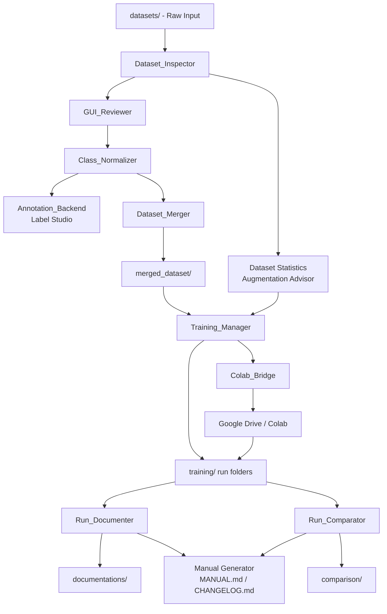
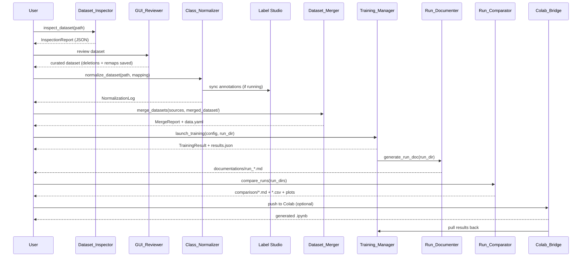

# Design Document: Anti-UAV Dataset Management and YOLO26 Training Workflow

## Overview

This system is a Python-based desktop application and CLI toolkit for managing anti-UAV object detection datasets and training YOLO26 models. It covers the full ML pipeline: dataset ingestion → inspection → GUI curation → class normalization → merging → hardware-aware training → validation → documentation → comparison → Colab offloading.

The three canonical detection classes throughout the entire pipeline are **Bird**, **Drone** (small drones), and **UAV** (large drones/unmanned aerial vehicles).

The system is designed as a collection of loosely coupled Python modules, each with a CLI entry point, unified under a single launcher GUI. Components communicate via the filesystem (JSON reports, YAML configs, annotation files) and a shared Python API layer.

---

## Architecture

### High-Level Component Diagram



### Deployment Model

All components run locally on the user's machine. The optional Colab_Bridge component communicates with Google Drive via the Google Drive API. Label Studio runs as a local web server process managed by the workflow system.

```
project_root/
├── datasets/              # Raw input datasets (folders or ZIPs)
├── merged_dataset/        # Merged, normalized, deduplicated dataset
│   └── data.yaml
├── training/              # Per-run output folders
│   └── run_{YYYYMMDD}_{HHMMSS}_{model_variant}/
│       ├── weights/
│       │   ├── best.pt
│       │   └── last.pt
│       ├── results.json
│       ├── train_config.yaml
│       └── plots/
├── documentations/        # Per-run Markdown docs
├── comparison/            # Comparison reports and plots
├── MANUAL.md
├── CHANGELOG.md
└── anti_uav/              # Python package source
    ├── __init__.py
    ├── inspector.py
    ├── reviewer.py
    ├── normalizer.py
    ├── backend.py
    ├── merger.py
    ├── trainer.py
    ├── documenter.py
    ├── comparator.py
    ├── colab_bridge.py
    ├── manual_generator.py
    ├── models.py          # Shared data models (dataclasses)
    ├── utils.py           # Shared utilities
    └── gui/
        ├── launcher.py    # Unified launcher GUI
        └── reviewer_ui.py # GUI_Reviewer PyQt5 window
```

### Technology Stack

| Concern | Technology |
|---|---|
| Language | Python 3.10+ |
| GUI | PyQt5 (preferred over tkinter for richer widget set, native look) |
| YOLO Training | ultralytics >= 8.4.0 (YOLO26 family) |
| Annotation Backend | label-studio + label-studio-sdk |
| Google Drive API | google-api-python-client, google-auth-oauthlib |
| Kaggle API | kaggle (official Kaggle Python client) |
| Notebook Generation | nbformat |
| Data Serialization | PyYAML, json (stdlib) |
| Image Hashing | hashlib (stdlib, SHA-256) |
| Annotation Parsing | xml.etree.ElementTree (VOC), json (COCO), custom (YOLO TXT) |
| Plotting | matplotlib |
| CLI | argparse (stdlib) |
| Packaging | setuptools with console_scripts entry points |

---

## Components and Interfaces

### Dataset_Inspector (`anti_uav/inspector.py`)

Scans a folder or ZIP archive and produces a structured report.

**CLI:** `anti-uav inspect <path>`

**Public API:**
```python
def inspect_dataset(path: str | Path) -> InspectionReport:
    """Scan a folder or ZIP. Returns structured report. Does not modify input."""

def detect_annotation_format(folder: Path) -> AnnotationFormat:
    """Detect YOLO TXT, COCO JSON, Pascal VOC XML, or UNKNOWN."""

def parse_yolo_txt(label_dir: Path) -> list[Annotation]:
    ...

def parse_coco_json(json_path: Path) -> list[Annotation]:
    ...

def parse_voc_xml(xml_dir: Path) -> list[Annotation]:
    ...

def compute_statistics(annotations: list[Annotation], images: list[Path]) -> DatasetStats:
    """Compute resolution distribution, aspect ratios, bbox sizes, class balance."""
```

**Behavior:**
- ZIP archives are extracted to a `tempfile.mkdtemp()` directory; the original ZIP is never modified.
- Unparseable annotation files are logged to `inspection_errors.log` alongside the output JSON; scanning continues.
- Output JSON is written to `{dataset_folder}/inspection_report.json`.

---

### GUI_Reviewer (`anti_uav/gui/reviewer_ui.py`)

PyQt5 desktop application for image curation and label remapping.

**CLI:** `anti-uav review <dataset_path>`

**Architecture:** Model-View pattern. The `ReviewerModel` holds state (staged deletions, label remaps); the `ReviewerWindow` (QMainWindow) renders it.

**Key Widgets:**
- `ImageGridWidget` (QScrollArea + QGridLayout of QLabel thumbnails) — grid view
- `DetailWidget` (QLabel + custom overlay painter) — single image with bbox overlays
- `AnnotationPanel` (QListWidget) — lists bboxes for selected image; allows label remap via QComboBox
- `FilterBar` (QComboBox) — filter by class
- `StatusBar` (QStatusBar) — live counts

**Public API (ReviewerModel):**
```python
class ReviewerModel:
    def load_dataset(self, path: Path) -> None: ...
    def stage_deletion(self, image_path: Path) -> None: ...
    def unstage_deletion(self, image_path: Path) -> None: ...
    def confirm_deletions(self) -> list[Path]: ...  # deletes files, returns deleted paths
    def remap_label(self, image_path: Path, bbox_idx: int, new_label: CanonicalClass) -> None: ...
    def save_changes(self) -> None: ...  # writes annotation files in source format
    def get_counts(self) -> ReviewCounts: ...
    def filter_by_class(self, cls: str | None) -> list[Path]: ...
```

---

### Class_Normalizer (`anti_uav/normalizer.py`)

Remaps all source class labels to the canonical set.

**CLI:** `anti-uav normalize <dataset_path> --mapping mapping.json`

**Public API:**
```python
def normalize_dataset(
    dataset_path: Path,
    mapping: dict[str, CanonicalClass],
    backend_url: str | None = None,
) -> NormalizationLog:
    """Apply mapping to all annotation files. Sync to Label Studio if backend_url provided."""

def load_mapping(path: Path) -> dict[str, CanonicalClass]:
    """Load JSON mapping file. Raises UnmappedClassError if any source class maps to nothing."""

def find_unmapped_classes(dataset_path: Path, mapping: dict[str, CanonicalClass]) -> list[str]:
    """Return list of class names in dataset not covered by mapping."""
```

**Mapping file format (`mapping.json`):**
```json
{
  "bird": "Bird",
  "drone": "Drone",
  "quadcopter": "Drone",
  "fixed-wing": "UAV",
  "uav": "UAV"
}
```

---

### Annotation_Backend (`anti_uav/backend.py`)

Manages a local Label Studio instance.

**CLI:** `anti-uav backend start|stop|import|export`

**Public API:**
```python
def start_label_studio(port: int = 8080) -> subprocess.Popen: ...
def stop_label_studio(proc: subprocess.Popen) -> None: ...
def create_project(client: LabelStudio, name: str) -> Project:
    """Create project pre-configured with Bird/Drone/UAV labels only."""
def import_dataset(project: Project, dataset_path: Path) -> None: ...
def export_yolo(project: Project, output_path: Path) -> None: ...
def is_running(url: str) -> bool: ...
```

Label Studio is configured via its SDK (`label_studio_sdk`). The project label config XML is generated programmatically with exactly three `<Label>` elements.

---

### Dataset_Merger (`anti_uav/merger.py`)

Merges multiple curated datasets into `merged_dataset/`.

**CLI:** `anti-uav merge`

**Public API:**
```python
def merge_datasets(
    source_dirs: list[Path],
    output_dir: Path,
    splits: tuple[float, float, float] = (0.7, 0.2, 0.1),
) -> MergeReport:
    """Merge, deduplicate by SHA-256, re-index filenames, write data.yaml."""

def sha256_hash(image_path: Path) -> str: ...

def write_data_yaml(output_dir: Path, classes: list[str], splits: dict[str, Path]) -> None: ...

def detect_imbalance(class_counts: dict[str, int], threshold: float = 5.0) -> list[str]:
    """Return list of minority classes if max/min ratio exceeds threshold."""
```

**Filename re-indexing scheme:** `{source_dataset_name}_{original_stem}{ext}` — deterministic, collision-free across sources.

---

### Training_Manager (`anti_uav/trainer.py`)

Configures and launches YOLO26 training runs.

**CLI:** `anti-uav train --profile rtx2070|colab_t4 [--override-model yolo26m]`

**Hardware Profiles:**

| Profile | Model | imgsz | batch | epochs | optimizer | AMP | Peak VRAM target |
|---|---|---|---|---|---|---|---|
| rtx2070 | yolo26s | 640 | 16 | 100 | MuSGD | True | < 7.5 GB |
| colab_t4 | yolo26m | 640 | 32 | 100 | MuSGD | True | < 14 GB |
| kaggle_dual_t4 | yolo26m | 640 | 64 | 100 | MuSGD | True | < 14 GB × 2 (DDP) |

**Public API:**
```python
def get_hardware_profile(profile: HardwareProfile) -> TrainingConfig: ...

def create_run_folder(base: Path, model_variant: str) -> Path:
    """Create training/run_{YYYYMMDD}_{HHMMSS}_{model_variant}/"""

def launch_training(config: TrainingConfig, run_dir: Path) -> TrainingResult:
    """Launch ultralytics YOLO training. Handles interruption, saves checkpoint."""

def resume_training(run_dir: Path) -> TrainingResult: ...

def evaluate_model(weights_path: Path, data_yaml: Path, run_dir: Path) -> ValidationMetrics: ...

def initialize_project_dirs(root: Path) -> None:
    """Create datasets/, merged_dataset/, training/, documentations/, comparison/ if absent."""
```

**Augmentation defaults for aerial imagery:**
```yaml
mosaic: 1.0
mixup: 0.15
copy_paste: 0.3   # elevated for small objects
hsv_h: 0.015
hsv_s: 0.7
hsv_v: 0.4
degrees: 10.0
translate: 0.1
scale: 0.5
flipud: 0.1
fliplr: 0.5
```

---

### Run_Documenter (`anti_uav/documenter.py`)

Generates per-run Markdown documentation.

**CLI:** `anti-uav document <run_dir>`

**Public API:**
```python
def generate_run_doc(run_dir: Path, output_dir: Path) -> Path:
    """Read results.json and train_config.yaml from run_dir, write .md to output_dir."""

def append_changelog_entry(root: Path, run_id: str, metrics: ValidationMetrics, passed: bool) -> None:
    """Append one-line summary to CHANGELOG.md."""
```

---

### Run_Comparator (`anti_uav/comparator.py`)

Compares multiple runs and generates reports.

**CLI:** `anti-uav compare [--runs run1 run2 ...]`

**Public API:**
```python
def compare_runs(run_dirs: list[Path], output_dir: Path) -> ComparisonReport:
    """Read results.json from each run, rank by mAP@0.5:0.95, write .md and .csv."""

def plot_iou_sensitivity(best_run_dir: Path, output_dir: Path) -> Path:
    """Plot mAP vs IoU threshold 0.5..0.95 step 0.05 for best run."""

def highlight_param_diffs(runs: list[TrainingConfig]) -> dict[str, list]: ...
```

---

### Colab_Bridge (`anti_uav/colab_bridge.py`)

Handles remote training offload to either Google Colab (semi-automated, via Google Drive) or Kaggle (fully automated, via Kaggle API). The backend is selected at call time via a `RemoteBackend` enum.

**CLI:** `anti-uav colab --backend colab|kaggle push|pull|generate-notebook`

**New enum:**
```python
class RemoteBackend(str, Enum):
    COLAB = "colab"
    KAGGLE = "kaggle"
```

**Public API:**
```python
# --- Shared ---
def generate_notebook(
    config: TrainingConfig,
    backend: RemoteBackend,
    remote_folder_id: str,
) -> nbformat.NotebookNode:
    """Generate .ipynb tailored for the selected backend (Drive mount vs Kaggle dataset mount)."""

# --- Colab backend ---
def authenticate_google(method: AuthMethod, credentials_path: Path | None = None) -> GoogleDriveService:
    """OAuth2 device flow or service account key file."""

def upload_to_drive(service: GoogleDriveService, local_path: Path, drive_folder_id: str) -> UploadManifest:
    """Upload merged_dataset/ and config to Google Drive with resume support."""

def download_from_drive(service: GoogleDriveService, drive_folder_id: str, local_path: Path) -> None: ...

def retry_failed_uploads(service: GoogleDriveService, manifest: UploadManifest) -> None:
    """Re-upload only files not in manifest.uploaded."""

# --- Kaggle backend ---
def authenticate_kaggle(credentials_path: Path) -> None:
    """Load kaggle.json API token. Raises AuthenticationError on failure."""

def upload_dataset_to_kaggle(local_path: Path, dataset_slug: str) -> None:
    """Push merged_dataset/ as a Kaggle dataset via `kaggle datasets push`."""

def push_kaggle_kernel(notebook: nbformat.NotebookNode, kernel_slug: str, dataset_slug: str) -> None:
    """Push and trigger kernel via `kaggle kernels push`. No browser required."""

def poll_kaggle_kernel(kernel_slug: str, poll_interval: int = 30, timeout: int = 32400) -> KernelStatus:
    """Poll `kaggle kernels status` until complete, failed, or 9-hour timeout."""

def download_kaggle_output(kernel_slug: str, local_path: Path) -> None:
    """Download kernel outputs via `kaggle kernels output`."""
```

**Kaggle dual-T4 support:** When `config.hardware_profile == HardwareProfile.KAGGLE_DUAL_T4`, the generated notebook sets `device: "0,1"` in the Ultralytics training call to enable DDP across both T4s.

**Kaggle timeout handling:** If `poll_kaggle_kernel` detects a timeout (kernel status `"error"` with runtime ≥ 9h), it downloads partial outputs and writes `results.json` with `completed=False`, allowing `resume_training` to pick up from the last checkpoint in a new kernel push.

**Colab limitation note:** Colab free tier has no programmatic execution API. After `upload_to_drive` and `generate_notebook`, the system notifies the user to open the notebook in a browser and click "Run All". Results are pulled back via `download_from_drive` once the user confirms completion.

---

### Manual_Generator (`anti_uav/manual_generator.py`)

**CLI:** `anti-uav manual`

**Public API:**
```python
def generate_manual(root: Path) -> Path:
    """Write MANUAL.md at project root covering all 8 required sections."""
```

---

### Unified Launcher GUI (`anti_uav/gui/launcher.py`)

PyQt5 QMainWindow with a tab or sidebar for each component. Provides buttons to invoke each CLI operation without leaving the GUI. Embeds the GUI_Reviewer as a tab.

**CLI:** `anti-uav` (no subcommand launches the GUI)

---

## Data Models

All shared data models are defined as Python dataclasses in `anti_uav/models.py`.

```python
from dataclasses import dataclass, field
from enum import Enum
from pathlib import Path

class AnnotationFormat(Enum):
    YOLO_TXT = "yolo_txt"
    COCO_JSON = "coco_json"
    PASCAL_VOC = "pascal_voc"
    UNKNOWN = "unknown"

class CanonicalClass(str, Enum):
    BIRD = "Bird"
    DRONE = "Drone"
    UAV = "UAV"

class HardwareProfile(str, Enum):
    RTX2070 = "rtx2070"
    COLAB_T4 = "colab_t4"
    KAGGLE_DUAL_T4 = "kaggle_dual_t4"  # two T4s via Kaggle DDP

class AuthMethod(str, Enum):
    OAUTH2 = "oauth2"
    SERVICE_ACCOUNT = "service_account"

class RemoteBackend(str, Enum):
    COLAB = "colab"    # semi-automated, requires manual "Run All" in browser
    KAGGLE = "kaggle"  # fully automated via Kaggle API

class KernelStatus(str, Enum):
    RUNNING = "running"
    COMPLETE = "complete"
    ERROR = "error"
    QUEUED = "queued"

@dataclass
class BoundingBox:
    class_name: str
    x_center: float   # normalized [0,1]
    y_center: float
    width: float
    height: float

@dataclass
class Annotation:
    image_path: Path
    boxes: list[BoundingBox]
    source_format: AnnotationFormat

@dataclass
class DatasetStats:
    image_count: int
    class_counts: dict[str, int]
    resolution_distribution: dict[str, int]   # "WxH" -> count
    aspect_ratio_distribution: dict[str, int] # bucket -> count
    bbox_size_distribution: dict[str, int]    # "small"/"medium"/"large" -> count
    class_balance_ratio: float                # max_count / min_count

@dataclass
class InspectionReport:
    dataset_path: str
    annotation_format: AnnotationFormat
    stats: DatasetStats
    errors: list[str]                         # unparseable file paths

@dataclass
class NormalizationLog:
    substitutions: list[tuple[str, str, int]] # (source_label, target_label, file_count)
    total_files_modified: int
    unmapped_classes: list[str]

@dataclass
class MergeReport:
    total_images: int
    deduplicated_count: int
    class_counts: dict[str, int]
    imbalance_warnings: list[str]
    output_path: Path

@dataclass
class TrainingConfig:
    model_variant: str          # "yolo26s", "yolo26m", etc.
    imgsz: int
    batch: int
    epochs: int
    optimizer: str              # "MuSGD" or "AdamW"
    lr0: float
    weight_decay: float
    amp: bool
    augmentation: dict[str, float]
    hardware_profile: HardwareProfile
    data_yaml: Path
    run_dir: Path | None = None

@dataclass
class ValidationMetrics:
    map50: float
    map50_95: float
    precision: float
    recall: float
    f1: float
    per_class_map50: dict[str, float]
    small_object_map50: dict[str, float]
    false_positive_rate: float
    passed_gate: bool           # map50 >= 0.75

@dataclass
class TrainingResult:
    run_id: str
    config: TrainingConfig
    metrics: ValidationMetrics | None
    completed: bool
    duration_seconds: float
    checkpoint_path: Path | None

@dataclass
class ReviewCounts:
    total: int
    staged_for_deletion: int
    per_class: dict[str, int]

@dataclass
class ComparisonReport:
    runs: list[TrainingResult]   # sorted by map50_95 descending
    best_run_id: str
    param_diffs: dict[str, list]
    output_md: Path
    output_csv: Path

@dataclass
class UploadManifest:
    uploaded: dict[str, str]    # local_path -> drive_file_id
    failed: list[str]           # local_paths that failed
```

---

## Data Flow

### End-to-End Pipeline Flow



### File I/O Contract

Each component reads and writes well-defined files:

| Component | Reads | Writes |
|---|---|---|
| Dataset_Inspector | `datasets/**` | `{dataset}/inspection_report.json` |
| GUI_Reviewer | `{dataset}/**` | Updated annotation files in-place |
| Class_Normalizer | Annotation files | Updated annotation files + `normalization_log.json` |
| Dataset_Merger | `datasets/*/` | `merged_dataset/**` + `data.yaml` |
| Training_Manager | `merged_dataset/data.yaml` | `training/run_*/` |
| Run_Documenter | `training/run_*/results.json` | `documentations/run_*.md` + `CHANGELOG.md` |
| Run_Comparator | `training/*/results.json` | `comparison/*.md` + `*.csv` + plots |
| Colab_Bridge | `merged_dataset/` + run YAML | `.ipynb` + downloaded run folder |
| Manual_Generator | All of the above | `MANUAL.md` |

---

## Error Handling

### Strategy by Component

**Dataset_Inspector:**
- Unparseable annotation files: log path to `inspection_errors.log`, continue scanning. Never raise on individual file errors.
- ZIP extraction failure: raise `InspectionError` with the ZIP path.
- Empty dataset: return `InspectionReport` with `image_count=0` and a warning in `errors`.

**Class_Normalizer:**
- Unmapped class: raise `UnmappedClassError(class_name)` before modifying any files. The caller (CLI or GUI) prompts the user to assign the class.
- Label Studio unreachable: log warning, fall back to local-only normalization. Never block the pipeline.

**Dataset_Merger:**
- SHA-256 collision (duplicate): log to `merge_duplicates.log`, keep first occurrence, skip subsequent.
- Class imbalance > 5:1: emit `ImbalanceWarning`, continue merge.

**Training_Manager:**
- SIGINT / KeyboardInterrupt during training: catch, save last checkpoint, write `results.json` with `completed=False`.
- VRAM OOM: catch `RuntimeError` from PyTorch, log suggestion to reduce batch size or switch to smaller model variant.

**Colab_Bridge:**
- Upload failure: record failed file in `UploadManifest.failed`, allow retry. Retry skips files already in `UploadManifest.uploaded`.
- Auth failure: raise `AuthenticationError` with instructions for both auth methods.

**General:**
- All components use Python `logging` with a shared logger `anti_uav`. Log level configurable via `--verbose` flag.
- All public functions that write files do so atomically where possible (write to `.tmp` then rename).

---

## Testing Strategy

### Dual Testing Approach

Unit tests cover specific examples, edge cases, and error conditions. Property-based tests verify universal properties across many generated inputs. Both are needed for comprehensive coverage.

**Property-based testing library:** `hypothesis` (Python). Each property test runs a minimum of 100 iterations (`settings(max_examples=100)`).

**Test tag format:** `# Feature: anti-uav-dataset-workflow, Property {N}: {property_text}`

### Unit Tests

- One test module per component: `tests/test_inspector.py`, `tests/test_normalizer.py`, etc.
- Use `pytest` as the test runner.
- GUI tests use `pytest-qt` for PyQt5 widget testing.
- External services (Label Studio, Google Drive) are mocked with `unittest.mock`.

### Integration Tests

- `tests/integration/test_label_studio_sync.py` — verifies Label Studio SDK sync call is made after normalization (mocked SDK).
- `tests/integration/test_colab_bridge.py` — verifies Drive API upload/download calls (mocked Drive service).
- `tests/integration/test_training_pipeline.py` — end-to-end run with a tiny synthetic dataset (10 images, 5 epochs).

### Smoke Tests

- `tests/smoke/test_init.py` — verify project directory initialization creates all required folders.
- `tests/smoke/test_launcher.py` — verify GUI launcher starts without error.
- `tests/smoke/test_manual_generation.py` — verify MANUAL.md is created.


---

## Correctness Properties

*A property is a characteristic or behavior that should hold true across all valid executions of a system — essentially, a formal statement about what the system should do. Properties serve as the bridge between human-readable specifications and machine-verifiable correctness guarantees.*

### Property Reflection

Before listing properties, redundancies were eliminated:

- 1.4 (JSON report written) and 1.1 (report contains correct stats) are combined: the round-trip property covers both existence and correctness.
- 5.6 and 11.2 both test the 5:1 imbalance threshold — combined into one property.
- 10.2 and 10.6 both test notebook completeness — combined into one property.
- 2.3 (staging does not delete) and 2.4 (confirmed deletion removes files) are kept separate as they test distinct state transitions.
- 13.3 (pass gate) is kept distinct from 13.1 (metrics completeness) as they test different invariants.

---

### Property 1: Dataset inspection round-trip correctness

*For any* dataset folder containing images and annotation files in a supported format, running `inspect_dataset` and reading the resulting `inspection_report.json` should produce an `InspectionReport` whose `stats.class_counts` values sum to the actual total annotation count found in the dataset.

**Validates: Requirements 1.1, 1.4**

---

### Property 2: ZIP extraction preserves original archive

*For any* ZIP archive, the SHA-256 hash of the archive before calling `inspect_dataset` should equal the SHA-256 hash after the call completes.

**Validates: Requirements 1.2**

---

### Property 3: Annotation format detection is correct

*For any* dataset generated in one of the three supported formats (YOLO TXT, COCO JSON, Pascal VOC XML), `detect_annotation_format` should return the correct `AnnotationFormat` enum value.

**Validates: Requirements 1.5**

---

### Property 4: Deletion staging does not remove files

*For any* set of images in a dataset, calling `stage_deletion` on any subset should leave all image and annotation files present on disk until `confirm_deletions` is called.

**Validates: Requirements 2.3**

---

### Property 5: Confirmed deletion removes all staged files

*For any* set of images staged for deletion, after calling `confirm_deletions` neither the image file nor its corresponding annotation file should exist on disk.

**Validates: Requirements 2.4**

---

### Property 6: Label remap produces canonical class

*For any* annotation and any target `CanonicalClass`, after calling `remap_label` the annotation's class name at the specified index should equal the target canonical class string.

**Validates: Requirements 2.5**

---

### Property 7: Class filter returns only matching images

*For any* dataset and any class name filter, `filter_by_class` should return only image paths whose annotation files contain at least one bounding box with that class label.

**Validates: Requirements 2.6**

---

### Property 8: Save-then-reload preserves annotations

*For any* set of annotation changes applied via `remap_label`, calling `save_changes` and then reloading the annotation files should produce annotations equivalent to the in-memory state at save time.

**Validates: Requirements 2.7**

---

### Property 9: Status counts match actual file counts

*For any* dataset state (any combination of staged deletions and label remaps), `get_counts` should return counts that match the actual number of image files, staged files, and per-class annotation counts.

**Validates: Requirements 2.8**

---

### Property 10: Normalization produces only canonical labels

*For any* dataset and any mapping table that covers all source classes, after `normalize_dataset` completes every class label in every annotation file should be one of `Bird`, `Drone`, or `UAV`.

**Validates: Requirements 3.2**

---

### Property 11: Normalization log entry count matches substitutions

*For any* normalization run, the sum of `file_count` values across all entries in `NormalizationLog.substitutions` should equal `total_files_modified`.

**Validates: Requirements 3.5**

---

### Property 12: Label Studio export preserves filenames

*For any* set of images imported into Label Studio and then exported via `export_yolo`, the exported annotation filenames (stems) should match the original image filenames (stems).

**Validates: Requirements 4.5**

---

### Property 13: Merge preserves train/val/test split structure

*For any* set of source datasets that each contain train/val/test subdirectories, after `merge_datasets` the output directory should contain train/, val/, and test/ subdirectories with non-empty image and label folders.

**Validates: Requirements 5.1**

---

### Property 14: Merged filenames are unique

*For any* set of source datasets (including those with overlapping filenames), after `merge_datasets` all image filenames in the output directory should be globally unique.

**Validates: Requirements 5.2**

---

### Property 15: SHA-256 deduplication keeps exactly one copy

*For any* set of images including known duplicates (identical content, different filenames), after `merge_datasets` each unique SHA-256 hash should appear exactly once in the output directory.

**Validates: Requirements 5.3**

---

### Property 16: data.yaml contains canonical classes and valid split paths

*For any* merge operation, the resulting `data.yaml` should list exactly `['Bird', 'Drone', 'UAV']` as the class names and reference paths that exist on disk.

**Validates: Requirements 5.4**

---

### Property 17: Class imbalance warning fires at correct threshold

*For any* dataset where the ratio of the largest class count to the smallest class count exceeds 5.0, `detect_imbalance` should return a non-empty list of minority class names. For any dataset where the ratio is ≤ 5.0, it should return an empty list.

**Validates: Requirements 5.6, 11.2**

---

### Property 18: Hardware profile suggestions are complete

*For any* `HardwareProfile` value, `get_hardware_profile` should return a `TrainingConfig` where all required fields (model_variant, imgsz, batch, epochs, optimizer, lr0, weight_decay, amp, augmentation) are non-None and the augmentation dict contains all aerial-imagery keys (mosaic, mixup, copy_paste, hsv_h, hsv_s, hsv_v, degrees, translate, scale, flipud, fliplr).

**Validates: Requirements 6.1, 6.5**

---

### Property 19: Training config round-trip via YAML

*For any* `TrainingConfig`, serializing it to YAML and deserializing it should produce an equivalent `TrainingConfig` with all fields equal.

**Validates: Requirements 6.6**

---

### Property 20: Run folder name matches required pattern

*For any* call to `create_run_folder`, the resulting folder name should match the regex `^run_\d{8}_\d{6}_(yolo26s|yolo26m|yolo26l|yolo26x)$`.

**Validates: Requirements 7.1**

---

### Property 21: results.json contains all required metric fields

*For any* completed training run, the `results.json` file should contain all of: `map50`, `map50_95`, `precision`, `recall`, `f1`, `per_class_map50`, `small_object_map50`, `false_positive_rate`, `passed_gate`, `completed`, `duration_seconds`.

**Validates: Requirements 7.3, 13.1**

---

### Property 22: Pass gate status is correct

*For any* `ValidationMetrics` object, `passed_gate` should be `True` if and only if `map50 >= 0.75`.

**Validates: Requirements 13.3**

---

### Property 23: Small-object mAP flag fires at correct threshold

*For any* `ValidationMetrics` where a canonical class has `small_object_map50[cls] < per_class_map50[cls] - 0.15`, the run documentation should include a STAL recommendation for that class. For any class where the gap is < 0.15, no such recommendation should appear.

**Validates: Requirements 13.4**

---

### Property 24: Run documentation contains all required sections

*For any* completed training run, the generated Markdown documentation file should contain all of the following section headings: dataset used, model variant, training parameters, hardware profile, final metrics, training duration, warnings/anomalies, plain-language justification, and Validation Summary.

**Validates: Requirements 8.2, 13.6**

---

### Property 25: Non-default augmentation deviation is noted in docs

*For any* training run where any augmentation parameter differs from the system defaults, the generated documentation should contain a section noting the deviation.

**Validates: Requirements 8.4**

---

### Property 26: Comparison report includes all completed runs

*For any* set of completed run directories, `compare_runs` should produce a `ComparisonReport` whose `runs` list contains one entry for every run directory that has a valid `results.json` with `completed=True`.

**Validates: Requirements 9.1**

---

### Property 27: Comparison runs are sorted by mAP@0.5:0.95 descending

*For any* set of completed runs with distinct `map50_95` values, the `runs` list in `ComparisonReport` should be sorted in descending order of `map50_95`.

**Validates: Requirements 9.2**

---

### Property 28: Comparison report produces both Markdown and CSV

*For any* comparison operation, both a `.md` file and a `.csv` file should be written under `comparison/`, and both should contain a row/section for every run in the report.

**Validates: Requirements 9.4**

---

### Property 29: Comparison report includes small-object mAP and FPR columns

*For any* comparison report, the CSV output should contain columns for `small_object_map50` and `false_positive_rate` for each run.

**Validates: Requirements 13.5**

---

### Property 30: Generated Colab notebook is valid and contains required cells

*For any* `TrainingConfig`, `generate_notebook` should return a valid `nbformat.NotebookNode` (parseable by `nbformat.validate`) containing cells that cover: Drive mounting, dependency installation, dataset extraction, training execution, and result archiving.

**Validates: Requirements 10.2, 10.6**

---

### Property 31: Project initialization is idempotent

*For any* existing project directory structure, calling `initialize_project_dirs` a second time should not modify, overwrite, or delete any existing files or directories.

**Validates: Requirements 12.3**

---

### Property 32: PR curve files exist for each canonical class after training

*For any* completed training run, the run's `plots/` subdirectory should contain a PR curve image file for each of the three canonical classes (Bird, Drone, UAV).

**Validates: Requirements 13.2**

---

### Property 33: MANUAL.md contains all required sections

*For any* call to `generate_manual`, the resulting `MANUAL.md` should contain all eight required section headings: Project Overview, Folder Structure, Step-by-Step Procedure, Trained Weights Guide, Results Interpretation, Run Comparison Guide, Troubleshooting, and Glossary.

**Validates: Requirements 14.2**

---

### Property 34: CHANGELOG.md contains entry for every completed run

*For any* completed training run, after `append_changelog_entry` is called, `CHANGELOG.md` should contain a line that includes the run ID, model variant, `map50` value, and pass/fail status.

**Validates: Requirements 14.3**
