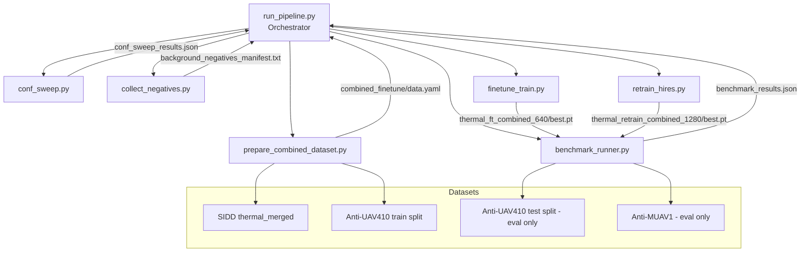

# Design Document: Thermal Model Improvement Pipeline

## Overview

This pipeline automates a five-step improvement workflow for the ThermalDrone YOLO26s detector. The current model achieves P=0.993 on Anti-UAV410 but only R=0.233 / F1=0.378 on Anti-MUAV1, indicating it misses small or fast-moving drones in challenging sequences. The pipeline addresses this through: confidence threshold optimisation, negative-example augmentation, Anti-UAV410 dataset integration, fine-tuning, and high-resolution retraining — with benchmarking after each training step.

All scripts are standalone `.py` files invoked via the fish-shell-compatible venv Python. No bash heredocs or `&&` chaining are used.

### Key Design Decisions

- **Reuse over rewrite**: The existing `eval_benchmark.py` and `eval_muav.py` scripts contain the core evaluation logic. The new `benchmark_runner.py` wraps and parameterises them rather than duplicating the IoU/matching logic.
- **Symlinks for Combined_Dataset**: Anti-UAV410 train frames are symlinked (not copied) into `combined_finetune/` to avoid duplicating ~GB of image data.
- **Invisible frames as background**: Both SIDD tiny-bbox frames and Anti-UAV410 invisible frames become background negatives with empty label files, directly suppressing false positives.
- **Separate scripts per step**: Each pipeline step is a self-contained script so individual steps can be re-run without re-executing the full pipeline.

---

## Architecture



The orchestrator (`run_pipeline.py`) calls each step script as a subprocess, captures stdout/stderr, and writes a timestamped log. Each step script is independently runnable.

---

## Components and Interfaces

### 1. `scripts/conf_sweep.py`

Evaluates the current `best.pt` at four confidence thresholds and selects the optimal one.

**CLI:**
```
python scripts/conf_sweep.py [--weights PATH] [--output PATH]
```

**Defaults:**
- `--weights`: `training/thermal_drone_yolo26s_rtx2070_100ep/weights/best.pt`
- `--output`: `training/thermal_drone_yolo26s_rtx2070_100ep/conf_sweep_results.json`

**Internal flow:**
1. Load YOLO model from weights path.
2. For each threshold in `[0.15, 0.20, 0.25, 0.30]`:
   - Call Anti-UAV410 eval (reusing `eval_benchmark.py` logic inline).
   - Call Anti-MUAV1 eval (reusing `eval_muav.py` logic inline).
   - Call SIDD val via `model.val()`.
3. Compute mean F1 across three benchmarks per threshold.
4. Select threshold with highest mean F1.
5. Write JSON and print summary table.

**Exit codes:** 0 = success, 1 = weights file not found or eval error.

---

### 2. `scripts/collect_negatives.py`

Collects ~500 background images from SIDD and Anti-UAV410 invisible frames.

**CLI:**
```
python scripts/collect_negatives.py [--target-count 500] [--manifest PATH]
```

**Internal flow:**
1. Scan SIDD `thermal_merged/train/labels/` for label files where all bboxes have `w * W * h * H < 100`.
2. Scan Anti-UAV410 train-split annotation `.txt` files for invisible frames (`w=0,h=0`).
3. Sample evenly across sequences up to `--target-count`.
4. Copy images to `thermal_merged/train/images/` and write empty `.txt` label files.
5. Write manifest to `training/background_negatives_manifest.txt`.

**Exit codes:** 0 = success, 1 = fatal I/O error.

---

### 3. `scripts/prepare_combined_dataset.py`

Converts Anti-UAV410 train-split annotations to YOLO format and builds the Combined_Dataset.

**CLI:**
```
python scripts/prepare_combined_dataset.py [--output-dir PATH]
```

**Internal flow:**
1. Read Anti-UAV410 train-split JSON annotation files from `Anti-UAV410-main/annos/train/`.
2. Convert each bbox: `cx=(x+w/2)/W`, `cy=(y+h/2)/H`, `bw=w/W`, `bh=h/H`.
3. Write YOLO `.txt` files to `Anti-UAV410-main/yolo_labels/train/`.
4. Create `thermal_datasets/combined_finetune/{train,val}/{images,labels}/`.
5. Symlink SIDD train images/labels and Anti-UAV410 train images/labels into `combined_finetune/train/`.
6. Symlink SIDD val images/labels into `combined_finetune/val/`.
7. Write `data.yaml` with `nc: 1`, `names: [Drone]`.
8. Print dataset summary.

**Exit codes:** 0 = success, 1 = missing annotation directory.

---

### 4. `scripts/finetune_train.py`

Fine-tunes the current `best.pt` on the Combined_Dataset.

**CLI:**
```
python scripts/finetune_train.py [--data PATH] [--weights PATH]
```

**Internal flow:**
1. Load YOLO model from current weights.
2. Call `model.train()` with `lr0=0.001`, `epochs=20`, `patience=8`, `imgsz=640`, `batch=8`, `amp=True`.
3. Save to `training/thermal_ft_combined_640/`.
4. On completion, call `benchmark_runner.py` with the new `best.pt` and optimal conf threshold.

**Exit codes:** 0 = success, 1 = data.yaml not found or training error.

---

### 5. `scripts/retrain_hires.py`

Retrains YOLO26s from scratch at `imgsz=1280` on the Combined_Dataset.

**CLI:**
```
python scripts/retrain_hires.py [--data PATH]
```

**Internal flow:**
1. Load `YOLO("yolo26s.pt")` (no transfer from ThermalDrone weights).
2. Call `model.train()` with `imgsz=1280`, `epochs=100`, `patience=30`, `lr0=0.005`, `batch=4`, `amp=True`.
3. Apply thermal augmentation profile: `hsv_h=0`, `hsv_s=0`, `copy_paste=0.7`, `erasing=0.3`, `flipud=0.3`, `fliplr=0.5`.
4. On OOM error, catch exception, log warning, retry with `batch=2`.
5. Save to `training/thermal_retrain_combined_1280/`.
6. On completion, call `benchmark_runner.py`.

**Exit codes:** 0 = success, 1 = data.yaml not found or unrecoverable training error.

---

### 6. `scripts/benchmark_runner.py`

Unified benchmark evaluation script for any weights file.

**CLI:**
```
python scripts/benchmark_runner.py --weights PATH --conf FLOAT --output PATH
```

**Internal flow:**
1. Load YOLO model from `--weights`.
2. Run Anti-UAV410 test-split evaluation (frame-level IoU matching, same logic as `eval_benchmark.py`).
3. Run Anti-MUAV1 evaluation (multi-track matching, same logic as `eval_muav.py`).
4. Run SIDD val via `model.val(conf=conf)`.
5. Write combined JSON to `--output`.
6. Print formatted summary table.

**Exit codes:** 0 = success (even if some benchmarks skipped), 1 = weights file not found.

---

### 7. `scripts/run_pipeline.py`

Orchestrator that runs all steps in order.

**CLI:**
```
python scripts/run_pipeline.py [--dry-run] [--start-from STEP]
```

**Steps:** `conf_sweep` → `negatives` → `prepare` → `finetune` → `retrain` → `benchmark`

**Internal flow:**
1. Build ordered list of `(step_name, command_list)` tuples.
2. If `--start-from` is given, skip steps before the named step.
3. If `--dry-run`, print commands and exit.
4. For each step: run subprocess, stream stdout, capture stderr.
5. On non-zero exit: log failure + stderr, halt.
6. Write timestamped log to `training/thermal_improvement_pipeline.log`.

---

## Data Models

### `conf_sweep_results.json`

```json
{
  "thresholds": {
    "0.15": {
      "antiuav410": {"precision": 0.0, "recall": 0.0, "f1": 0.0},
      "antimuav1":  {"precision": 0.0, "recall": 0.0, "f1": 0.0},
      "sidd_val":   {"precision": 0.0, "recall": 0.0, "mAP50": 0.0}
    },
    "0.20": { "..." : "..." },
    "0.25": { "..." : "..." },
    "0.30": { "..." : "..." }
  },
  "optimal_threshold": 0.25,
  "mean_f1_per_threshold": {"0.15": 0.0, "0.20": 0.0, "0.25": 0.0, "0.30": 0.0}
}
```

### `benchmark_results.json`

```json
{
  "weights": "/path/to/best.pt",
  "conf_threshold": 0.25,
  "antiuav410": {
    "precision": 0.0, "recall": 0.0, "f1": 0.0,
    "detection_rate": 0.0, "false_alarm_rate": 0.0,
    "tp": 0, "fp": 0, "fn": 0
  },
  "antimuav1": {
    "precision": 0.0, "recall": 0.0, "f1": 0.0,
    "detection_rate": 0.0, "tp": 0, "fn": 0, "fp_frames": 0
  },
  "sidd_val": {
    "mAP50": 0.0, "precision": 0.0, "recall": 0.0
  }
}
```

### `combined_finetune/data.yaml`

```yaml
path: /home/safsaf/Projects/UAV/UAV-dataset-workflow/thermal_datasets/combined_finetune
train: train/images
val: val/images
nc: 1
names: [Drone]
```

### YOLO Label File (per frame)

```
# Visible frame:
0 cx cy bw bh

# Invisible / background frame:
(empty file)
```

### `background_negatives_manifest.txt`

```
# source, dest_image, dest_label
sidd,/path/to/thermal_merged/train/images/bg_001.jpg,/path/to/thermal_merged/train/labels/bg_001.txt
antiuav410,/path/to/thermal_merged/train/images/bg_002.jpg,/path/to/thermal_merged/train/labels/bg_002.txt
```

---

## Correctness Properties

*A property is a characteristic or behavior that should hold true across all valid executions of a system — essentially, a formal statement about what the system should do. Properties serve as the bridge between human-readable specifications and machine-verifiable correctness guarantees.*

### Property 1: Threshold selection is argmax of mean F1

*For any* mapping of confidence thresholds to per-benchmark F1 scores, the selected optimal threshold must be the one with the highest mean F1 across all three benchmarks.

**Validates: Requirements 1.3**

---

### Property 2: Background candidate predicate correctness

*For any* SIDD frame annotation with given bbox dimensions and image size, `is_background(bbox, img_w, img_h)` returns `True` if and only if `w * img_w * h * img_h < 100`; and for any Anti-UAV410 annotation entry, `is_invisible(entry)` returns `True` if and only if `visible=0` or all bbox coordinates are zero.

**Validates: Requirements 2.2, 2.3**

---

### Property 3: Empty label invariant for all non-drone frames

*For any* background image collected (whether from SIDD tiny-bbox frames or Anti-UAV410 invisible frames), the corresponding YOLO label file must exist and contain zero annotation lines.

**Validates: Requirements 2.5, 3.3**

---

### Property 4: Manifest completeness

*For any* set of background images collected and written to the SIDD train directory, the manifest file must contain exactly those image paths — no more and no fewer.

**Validates: Requirements 2.7**

---

### Property 5: YOLO format round-trip

*For any* valid Anti-UAV410 bounding box `(x_tl, y_tl, w, h)` and image dimensions `(img_w, img_h)` where `w > 0` and `h > 0`, converting to YOLO format `(cx, cy, bw, bh)` and back to corner format must recover the original `(x_tl, y_tl, w, h)` values within a rounding error of 1 pixel for each coordinate.

**Validates: Requirements 3.2, 3.10**

---

### Property 6: Combined dataset membership

*For any* image present in `combined_finetune/train/images/`, that image must be traceable to either the SIDD `thermal_merged` train split or the Anti-UAV410 train split — no image from the Anti-UAV410 test split or Anti-MUAV1 may appear in the training set.

**Validates: Requirements 3.6**

---

### Property 7: Frame-level IoU matching correctness

*For any* ground-truth box and set of detection boxes, the frame-level match result must be `True` if and only if at least one detection box has IoU ≥ 0.5 with the ground-truth box; and the result must be `False` for all other cases.

**Validates: Requirements 6.3**

---

### Property 8: Multi-track false positive counting

*For any* frame where all GT tracks report the drone as invisible (not visible), any detection produced by the model on that frame must be counted as a false positive.

**Validates: Requirements 6.4**

---

### Property 9: Benchmark JSON round-trip

*For any* set of benchmark results (Anti-UAV410, Anti-MUAV1, SIDD val metrics), serializing to JSON and deserializing must recover all three benchmark result dicts with identical numeric values.

**Validates: Requirements 6.6**

---

### Property 10: Pipeline step ordering and start-from correctness

*For any* valid step name `S` in the pipeline step list `[conf_sweep, negatives, prepare, finetune, retrain, benchmark]`, running the pipeline with `--start-from S` must execute exactly the steps from `S` to the end of the list (inclusive) and skip all steps that precede `S` in the defined order.

**Validates: Requirements 7.1, 7.6**

---

### Property 11: Log entry completeness

*For any* pipeline step that completes (successfully or with failure), the log entry written to `thermal_improvement_pipeline.log` must contain the step name, elapsed time, and a status field indicating success or failure.

**Validates: Requirements 7.2**

---

## Error Handling

| Condition | Script | Behaviour |
|---|---|---|
| Weights file not found | `conf_sweep.py`, `benchmark_runner.py`, `finetune_train.py` | Print descriptive error, `sys.exit(1)` |
| `data.yaml` not found | `finetune_train.py`, `retrain_hires.py` | Print descriptive error, `sys.exit(1)` |
| Unreadable image file | `collect_negatives.py` | Log warning, skip file, continue |
| Malformed Anti-UAV410 annotation | `prepare_combined_dataset.py` | Log file path, skip sequence, continue |
| Missing benchmark dataset directory | `benchmark_runner.py` | Log warning, skip that benchmark, continue with others |
| GPU OOM at `batch=4` | `retrain_hires.py` | Catch exception, log warning, retry with `batch=2` |
| Pipeline step non-zero exit | `run_pipeline.py` | Log step name + stderr, halt pipeline, `sys.exit(1)` |

All scripts use Python's `logging` module at `INFO` level by default, with `WARNING` for skippable errors and `ERROR` for fatal conditions.

---

## Testing Strategy

### Unit Tests (pytest)

Unit tests cover pure functions and data transformation logic. They do not require GPU or dataset files.

**`test_conf_sweep.py`**
- Verify sweep iterates over exactly `[0.15, 0.20, 0.25, 0.30]` (example)
- Verify stdout contains threshold and metric column headers (example)
- Verify non-existent weights path raises SystemExit with non-zero code (edge case)

**`test_collect_negatives.py`**
- Verify both SIDD and Anti-UAV410 sources are queried with mock data (example)
- Verify unreadable file logs warning and continues (edge case)

**`test_prepare_combined_dataset.py`**
- Verify output directory structure is created (smoke)
- Verify `data.yaml` contains `nc=1`, `names=['Drone']`, and valid paths (example)
- Verify malformed annotation file is skipped without abort (edge case)

**`test_finetune_train.py`**
- Verify `model.train()` is called with correct hyperparameters (smoke)
- Verify non-existent `data.yaml` raises SystemExit (edge case)

**`test_retrain_hires.py`**
- Verify `model.train()` is called with `imgsz=1280`, thermal augmentation profile (smoke)
- Verify OOM exception triggers retry with `batch=2` and logs warning (edge case)

**`test_benchmark_runner.py`**
- Verify `--weights` and `--conf` CLI arguments are accepted (example)
- Verify missing dataset directory skips that benchmark and continues (edge case)
- Verify `model.val()` is called with correct `conf` parameter (example)

**`test_run_pipeline.py`**
- Verify `--dry-run` prints commands without launching subprocesses (example)
- Verify log file is created and contains entries (example)
- Verify non-zero step exit halts pipeline and logs stderr (edge case)

### Property-Based Tests (Hypothesis)

Property tests use [Hypothesis](https://hypothesis.readthedocs.io/) with a minimum of 100 iterations per property. Each test is tagged with a comment referencing the design property.

**`test_properties.py`**

```python
# Feature: thermal-model-improvement, Property 1: threshold selection is argmax of mean F1
# Feature: thermal-model-improvement, Property 2: background candidate predicate correctness
# Feature: thermal-model-improvement, Property 3: empty label invariant for non-drone frames
# Feature: thermal-model-improvement, Property 4: manifest completeness
# Feature: thermal-model-improvement, Property 5: YOLO format round-trip
# Feature: thermal-model-improvement, Property 6: combined dataset membership
# Feature: thermal-model-improvement, Property 7: frame-level IoU matching correctness
# Feature: thermal-model-improvement, Property 8: multi-track false positive counting
# Feature: thermal-model-improvement, Property 9: benchmark JSON round-trip
# Feature: thermal-model-improvement, Property 10: pipeline step ordering and start-from correctness
# Feature: thermal-model-improvement, Property 11: log entry completeness
```

Each property test generates random inputs using Hypothesis strategies (e.g., `st.floats`, `st.integers`, `st.lists`) and asserts the corresponding invariant. No GPU or real dataset files are required — all YOLO model calls are mocked.

**Configuration:** `@settings(max_examples=100)` on each property test.
